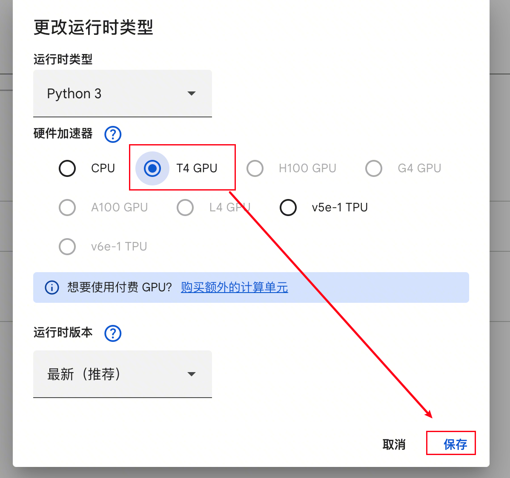
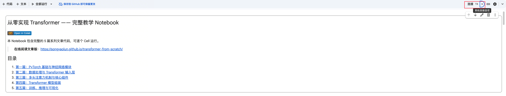
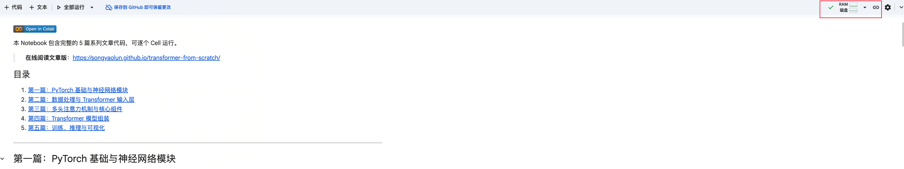
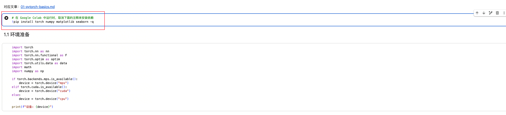
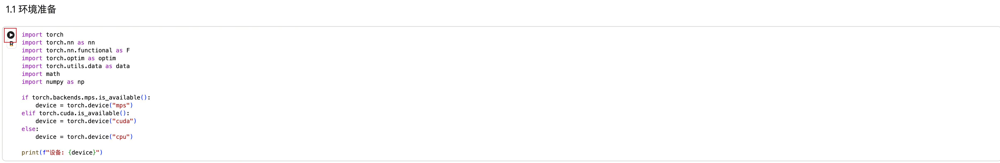
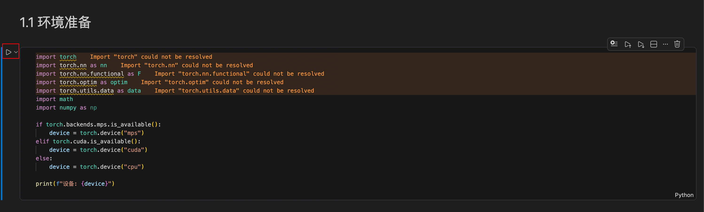
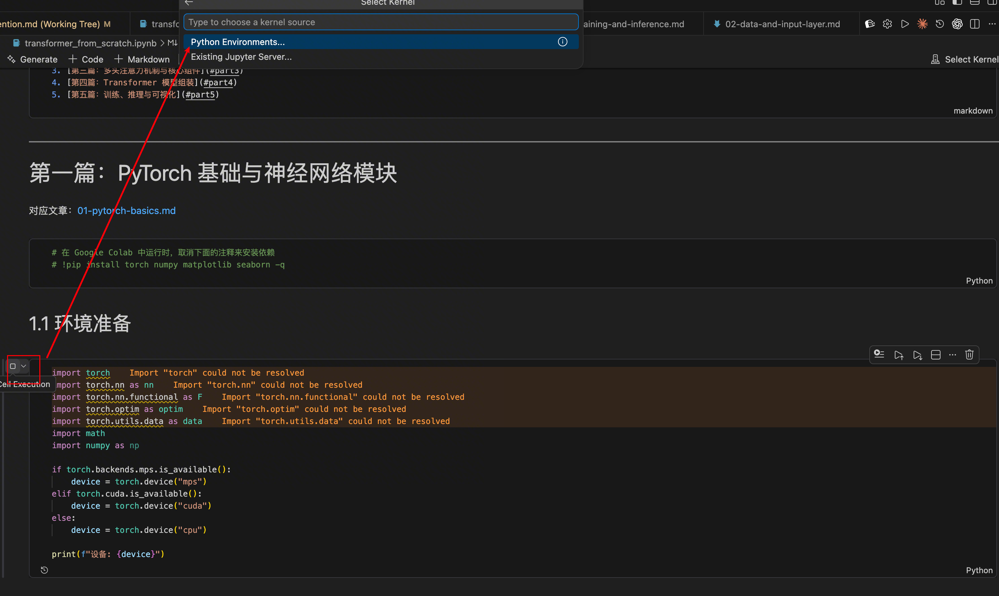
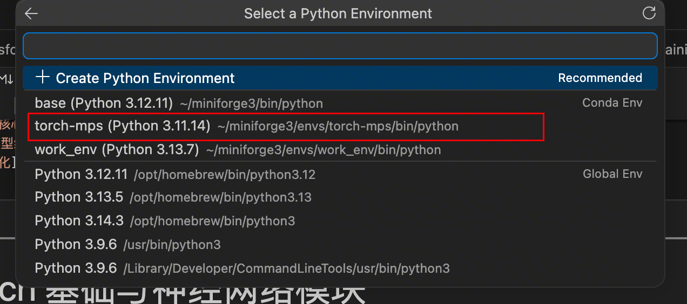

# 动手学AI ⚡️ 手写Transformer 01：环境与前期准备


## 系列目录

1. **环境与前期准备**（本篇）
2. [数据处理与 Transformer 输入层](02-data-and-input-layer.md)
3. [多头注意力机制与核心组件](03-multi-head-attention.md)
4. [模型组装](04-transformer-assembly.md)
5. [训练、推理与可视化](05-training-and-inference.md)

---

## 1. 环境准备

因为很多小白会卡在开头，这部分就冗余了一些。了解这些概念的同学直接跳到 Part 2。

### 1.1 Colab

打开本系列关联的 Github 仓库：https://github.com/songyaolun/transformer-from-scratch，按以下步骤操作：

**第一步**，点击仓库中的 notebook 链接，在 Colab 中打开：


**第二步**，在跳转的新页面中选择右上角的小三角，选择**更改运行时类型**：


**第三步**，选择 **T4 GPU** 并保存：



**第四步**，点击**连接 T4**，稍等几秒：



右上角出现 RAM 和磁盘，说明 Colab 已经连上了——给你分配了一台云端机器，有内存、有 GPU、有磁盘：



**第五步**，将下图的内容取消注释并运行，即可安装后文所需的全部依赖：



点击按钮开始运行代码：



### 1.2 PyCharm / VS Code

需要先在本地配置环境，推荐使用 Conda，安装好依赖后，第一次运行 Cell 时会询问你环境配置，指定到具体的配置就好。以 VS Code 举例：

点击 cell 左侧的 Run 按钮：



弹出环境配置选项：



选择具体的环境（我用 Conda 专门建了一个）：



然后运行第一段代码：

```python
import torch
import torch.nn as nn
import math

if torch.backends.mps.is_available():
    device = torch.device("mps")
elif torch.cuda.is_available():
    device = torch.device("cuda")
else:
    device = torch.device("cpu")

print(f"设备: {device}")
```

我的个人电脑是 M1 系列的 Mac，执行结果是 `设备: mps`。如果你用有 NVIDIA GPU 的电脑，或者使用 Colab 并选择了 Google 的免费 GPU，结果应该是 `设备: cuda`。

---

环境跑通了？下面正式开始。Transformer 的一切计算都建立在张量（Tensor）之上——你可以把它理解为多维数组的升级版。

---

## 2. 张量——AI 的积木

PyTorch 是当前深度学习的主流框架，类似于 Web 开发中的 React 或 Spring——帮你省掉重复劳动，专注核心逻辑。

### 创建张量

```python
import torch

# 从列表创建
x = torch.tensor([1, 2, 3])
print(x)         # tensor([1, 2, 3])
print(x.shape)   # torch.Size([3])

# 从二维列表创建
matrix = torch.tensor([[1, 2], [3, 4]])
print(matrix)        # tensor([[1, 2], [3, 4]])
print(matrix.shape)  # torch.Size([2, 2])
```

常用的创建方法：

```python
x = torch.zeros(2, 3)    # 全 0 张量
x = torch.ones(3, 2)     # 全 1 张量
x = torch.randn(3, 4)    # 标准正态分布张量
```

### 张量属性

```python
x = torch.randn(2, 4, 5)
print(x.shape)    # torch.Size([2, 4, 5])
print(x.dim())    # 3 (维度)
print(x.numel())  # 40 (元素总数)
print(x.dtype)    # torch.float32 (数据类型)
```

### 张量索引

```python
x = torch.tensor([[1, 2, 3], [4, 5, 6]])
print(x[0, 1])     # 2 (访问单个元素)
print(x[0])         # tensor([1, 2, 3]) (第一行)
print(x[:, 1:])     # tensor([[2, 3], [5, 6]]) (切片)
```

### 形状操作

#### view() — 变换形状

```python
x = torch.randn(2, 3, 4)
x_flat = x.view(2, -1)         # (2, 12)，-1 自动推断
x_high = x_flat.view(2, 2, -1, 2)  # (2, 2, 3, 2)
```

什么时候用？拆分多头注意力的时候（不理解没关系，后面会讲）：

```python
B, T, C = 2, 3, 8
x = torch.randn(B, T, C)
n_heads = 2
head_dim = C // n_heads
x_heads = x.view(B, T, n_heads, head_dim)  # (2, 3, 2, 4)
```

#### transpose() — 交换两个维度

```python
x = torch.randn(2, 3, 4)
x_t = x.transpose(1, 2)  # (2, 4, 3)
```

#### permute() — 重排所有维度

```python
x = torch.randn(2, 3, 4, 5)
x_p = x.permute(0, 3, 1, 2)  # (2, 5, 3, 4)
```

??? question "📖 transpose 和 permute 感觉差不多，为啥设计两个类似的方法呢？"

    `transpose` 源自矩阵转置，只交换两个维度，不感知其他维度；`permute` 可以一次重排所有维度。只需交换两个维度时，`transpose(0, 1)` 写法简洁，不必像 `permute(1, 0, 2, 3, 4, ...)` 那样罗列全部维度——维度越多差距越明显。反过来，需要重排多个维度时，`permute` 一行搞定，`transpose` 则要链式调用多次。

真实 Transformer 中的用法：

```python
B, T, C = 2, 3, 512
n_head = 8
head_dim = C // n_head
x = torch.randn(B, T, C)
x = x.view(B, T, n_head, head_dim)
x = x.permute(0, 2, 1, 3)  # (2, 8, 3, 64)
```

#### unsqueeze() / squeeze() — 增/减维度

函数名本身就很直观——squeeze 有"挤压"的意思。`squeeze()` 去掉所有大小为 1 的维度，就像把空气从包装袋里挤出去；`unsqueeze()` 则是在指定位置插入一个大小为 1 的维度。

```python
x = torch.tensor([1, 2, 3])   # shape: (3,)
x1 = x.unsqueeze(0)           # shape: (1, 3)，在第0维增加
x2 = x.unsqueeze(1)           # shape: (3, 1)，在第1维增加

x = torch.randn(1, 3, 1, 4)  # shape: (1, 3, 1, 4)
x = x.squeeze()                # shape: (3, 4)，删除所有大小为 1 的维度
```

??? question "📖 为什么有了 view 还要 squeeze/unsqueeze？"

    因为 `unsqueeze(1)` 不需要关心其他维度的 size，而 `view` 必须声明所有维度的值。

#### torch.cat() — 拼接张量

```python
x1 = torch.tensor([[1, 2, 3], [4, 5, 6]])
x2 = torch.tensor([[7, 8, 9], [10, 11, 12]])

torch.cat([x1, x2], dim=0)  # (4, 3)
torch.cat([x2, x1], dim=1)  # (2, 6)
```

#### contiguous() — 确保内存连续

```python
x = torch.randn(2, 3, 4)
x = x.transpose(0, 1)  # 转置后内存不连续
# x.view(2, 4, 3)  # 报错！
x = x.contiguous()
x = x.view(2, 4, 3)    # 正常
```

`transpose`、`permute` 等操作改变的是内存布局，而 `view` 要求内存连续，所以需要 `contiguous()`——就像书的页码乱了，`view` 要求页码连续才能重新装订。

### 矩阵运算

```python
a = torch.tensor([[1, 2, 3], [4, 5, 6]])
b = torch.tensor([[7, 8], [9, 10], [11, 12]])

a @ b              # 等价于 torch.matmul(a, b)
# tensor([[ 58,  64],
#         [139, 154]])

# 批量矩阵乘法
A = torch.randn(10, 2, 3)
B = torch.randn(10, 3, 4)
C = torch.matmul(A, B)  # (10, 2, 4)
```

### 掩码操作

```python
x = torch.randn(2, 3)
mask = torch.tensor([[True, False, True], [False, True, False]])
result = x.masked_fill(mask, -1e9)  # mask 为 True 的位置填 -1e9
```

三角掩码（Transformer 中用于防止看到未来信息）：

```python
x = torch.ones(4, 4)
torch.triu(x)  # 上三角
torch.tril(x)  # 下三角
```

### 比较操作

```python
# eq() 等于 | ne() 不等于 | gt() 大于 | ge() 大于等于 | lt() 小于 | le() 小于等于

x = torch.tensor([1, 0, 3, 0, 5])
mask = x.ne(0)  # 不等于 0 的位置为 True
print(f"不等于0的位置: {mask}")
```

---

## 3. nn.Module——搭积木的方式

`nn.Module` 是所有神经网络的基类，类似于 Java 的 Object 类。

### 3.1 基本结构

```python
import torch.nn as nn

class MyModel(nn.Module):
    def __init__(self):
        super().__init__()           # 必须调用！
        self.linear = nn.Linear(10, 5)

    def forward(self, x):
        return self.linear(x)

model = MyModel()
```

`super().__init__()` 是**必须调用**的，它初始化了参数注册、buffer 管理等功能。如果不调用，会直接报错：

```python
class BrokenModel(nn.Module):
    def __init__(self):
        self.linear = nn.Linear(10, 5)  # AttributeError!
```

### 3.2 完整的调用链演示

```python
class MyLayer(nn.Module):
    def __init__(self, in_features, out_features, name="MyLayer"):
        super().__init__()
        self.weight = nn.Parameter(torch.randn(out_features, in_features))
        self.name = name
        print(f"MyLayer 初始化完成，weight shape: {self.weight.shape}")

    def forward(self, x):
        print(f"MyLayer {self.name} 的forward被调用，input shape: {x.shape}")
        return x @ self.weight.t()


class MyModel(nn.Module):
    def __init__(self, in_features, out_features):
        super().__init__()
        self.layer1 = MyLayer(in_features, 40, "layer1")
        self.layer2 = MyLayer(40, 5, "layer2")

    def forward(self, x):
        print(f"MyModel 的forward被调用，input shape: {x.shape}")
        x = self.layer1(x)
        x = torch.relu(x)
        return self.layer2(x)


model = MyModel(10, 20)
x = torch.randn(2, 10)
output = model(x)
```

调用链路：

```
model(x) → model.__call__(x) → model.forward(x) → self.layer1(x)
  → layer1.__call__(x) → layer1.forward(x) → relu(x) → self.layer2(x)
  → layer2.__call__(x) → layer2.forward(x)
```

??? question "📖 为什么调用 model(x)，不直接调用 model.forward(x) 呢？"

    当你运行 `model(x)` 时，Python 实际调用的是 `model.__call__(x)`。在 `nn.Module` 的 `__call__` 方法中，会先运行各种 Hook，最后才调用你写的 `forward(x)`。

    ```python
    # nn.Module 的简化实现（仅供理解）
    class Module:
        def __call__(self, *args, **kwargs):
            # 1. 执行前置操作（各种 Hook）
            result = self.forward(*args, **kwargs)
            # 2. 执行后置操作
            return result
    ```

### 3.3 可跳过：关于 `__setattr__` 的细节

如果你看过 `nn.Module` 的 `__init__` 实现细节，你会看到这样的代码：

```python
super().__setattr__("training", True)
super().__setattr__("_parameters", {})
super().__setattr__("_buffers", {})
```

??? question "📖 为什么不直接用 self.training = True？"

    因为 PyTorch 重写了 `__setattr__` 方法，添加了对 parameters、submodules、buffers 的特殊处理。`__init__` 中只是想单纯赋值，所以调用父类 `object` 的 `__setattr__` 来避免无效开销。

### 3.4 常用层

#### nn.Linear — 全连接层

```python
# y = wx + b
linear = nn.Linear(10, 5)
x = torch.randn(2, 10)
output = linear(x)  # shape: (2, 5)
```

#### nn.Embedding — 词嵌入层

将离散的词索引映射到连续的向量空间，本质就是**查表操作**：

```python
embedding = nn.Embedding(num_embeddings=1000, embedding_dim=64)

indices = torch.tensor([1, 5, 3, 10])
output = embedding(indices)  # shape: (4, 64)

batch_indices = torch.tensor([[1, 4, 6], [10, 5, 19]])
output = embedding(batch_indices)  # shape: (2, 3, 64)
```

#### nn.LayerNorm — 层归一化

对每个样本的特征进行归一化（均值为 0，方差为 1）：

```python
dim = 5
layer_norm = nn.LayerNorm(dim)
x = torch.randn(2, 10, dim)
output = layer_norm(x)
```

#### nn.Dropout — 随机丢弃

训练时随机将部分参数设为 0，避免过拟合：

```python
drop_out = nn.Dropout(0.5)  # 50% 概率置零
output = drop_out(x)
```

??? question "📖 仔细观察下，为什么 Dropout 的非零值变化了呢，刚才不是说只会有一些值被置为 0 吗？"

    观察总结下其他值的规律，有没有什么发现，是不是他们变成了原来的 2 倍？

    被丢掉的值凭空消失了对吧，那把对应的非零值放大一倍，就能保证这些特征期望不变。缩放的倍数是 `1/(1-p)`，其中 p 是 dropout 的概率。总结：非零值会被放大 `1/(1-p)` 倍，保证特征期望不变。

#### 激活函数

```python
import torch.nn.functional as F

# ReLU：负数置零，正数不变
x = torch.tensor([-1.0, -0.5, 1.0, 2.0])
F.relu(x)  # tensor([0., 0., 1., 2.])

# Softmax：转为概率分布（和为1）
x = torch.tensor([1.0, 2.0, 3.0])
F.softmax(x, dim=-1)  # tensor([0.0900, 0.2447, 0.6652])
```

---

## 4. 训练流程——让模型学起来

### 4.1 设备管理

```python
x_cpu = torch.ones((3, 3))
print(f"x_cpu: device={x_cpu.device}, id={id(x_cpu)}")

x_gpu = x_cpu.to(device)
print(f"x_gpu: device={x_gpu.device}, id={id(x_gpu)}")
print("注意 id 不同，说明 tensor.to() 不是原地操作")

net = nn.Sequential(nn.Linear(3, 3))
print(f"\nmodel id: {id(net)}")
net.to(device)
print(f"model id: {id(net)}")
print("id 相同，model.to() 是原地操作")
```

??? question "📖 为什么张量需要 x = x.to(device) 而模型只需要 model.to(device)？"

    - **tensor** 从内存转移到显存，地址不一样了，不是 inplace 操作
    - **model** 内部的参数 tensor 换了，但 model 这个"容器"还是同一个对象引用

    想好好研究的可以参考：https://pytorch.zhangxiann.com/7-mo-xing-qi-ta-cao-zuo/7.3-shi-yong-gpu-xun-lian-mo-xing

### 4.2 损失函数

```python
# 分类任务用 CrossEntropyLoss
# 假设有 2 个样本，总共 3 个类别 (0:猫, 1:狗, 2:鸟)
# 第1个样本打分：模型认为大概率是猫 (1.5最高)
# 第2个样本打分：模型认为大概率是狗 (2.0最高)
# 真实标签：第1个是猫 (索引0)，第2个是鸟 (索引2)
# 猫预测准了，鸟没那么准
criterion = nn.CrossEntropyLoss()
output = torch.tensor([[1.5, 0.2, -0.5], [0.1, 2.0, 0.3]])
target = torch.tensor([0, 2])
loss = criterion(output, target)
```

!!! warning "常见坑"
    `CrossEntropyLoss` 内部已经帮你做了 Softmax，不要在模型输出层再加一次——加了反而会让训练不收敛。

```python
# 回归任务用 MSELoss
# 预测：第一套房 200万，第二套 400万
# 真实：第一套 220万，第二套 380万
criterion = nn.MSELoss()
output = torch.tensor([[200.0], [400.0]])
target = torch.tensor([[220.0], [380.0]])
loss = criterion(output, target)  # 400.0
```

### 4.3 优化器与训练循环

训练循环五步，就像健身：超量恢复（清空疲劳）→ 做动作 → 感受哪里酸 → 大脑记住 → 下次做得更好。

```python
import torch.optim as optim

model = SimpleNet()
criterion = nn.CrossEntropyLoss()
optimizer = optim.Adam(model.parameters(), lr=0.001)

for epoch in range(10):
    optimizer.zero_grad()       # 1. 清空梯度（清空疲劳）
    outputs = model(inputs)     # 2. 前向传播（做动作）
    loss = criterion(outputs, targets)  # 3. 计算损失（感受哪里酸）
    loss.backward()             # 4. 反向传播（大脑记住）
    optimizer.step()            # 5. 更新参数（下次做更好）
```

### 4.4 训练与评估模式

```python
model.train()  # 启用 Dropout, BatchNorm 等
model.eval()   # 禁用 Dropout, BatchNorm 等
```

| 特性 | model.eval() | torch.no_grad() |
|------|-------------|----------------|
| 作用对象 | 层的功能行为 | 梯度计算引擎 |
| 具体影响 | Dropout 不丢弃；BatchNorm 用统计均值 | 禁止构建计算图 |
| 是否省显存 | 否 | 是 |

两者通常成对出现。新版 PyTorch 中可用 `torch.inference_mode()` 替代 `torch.no_grad()`，性能更好。

### 4.5 梯度相关操作

```python
# 反向传播计算梯度
x = torch.tensor([2.0], requires_grad=True)
y = x ** 2
y.backward()
print(x.grad)  # tensor([4.])，对 y=x² 求导，x=2 时梯度为 4

# detach 分离梯度
z = y.detach()  # 不参与梯度计算

# 冻结预训练模型参数（迁移学习）
# detach 可以禁用某些层的梯度计算，但如果你是想复用模型参数做迁移学习，
# 最好使用 requires_grad_() 方法
for param in resnet.parameters():
    param.requires_grad_(False)
```

---

## 5. 一个完整的神经网络

把上面的知识串起来：

```python
import torch
import torch.nn as nn
import torch.optim as optim


class SimpleNet(nn.Module):
    def __init__(self):
        super().__init__()
        self.fc1 = nn.Linear(10, 20)
        self.fc2 = nn.Linear(20, 2)

    def forward(self, x):
        x = torch.relu(self.fc1(x))
        return self.fc2(x)


model = SimpleNet()
criterion = nn.CrossEntropyLoss()
optimizer = optim.Adam(model.parameters(), lr=0.001)

x = torch.randn(32, 10)
y = torch.randint(0, 2, (32,))

model.train()
optimizer.zero_grad()
output = model(x)
loss = criterion(output, y)
loss.backward()
optimizer.step()

print(f"损失值: {loss.item()}")
```

---

## 小结

本篇介绍了 PyTorch 的核心基础，也是手写 Transformer 的全部"原材料"：

| 模块 | 关键 API | 用途速查 |
|------|---------|---------|
| 张量创建 | `torch.tensor`, `zeros`, `ones`, `randn` | 构造数据 |
| 形状操作 | `view`, `transpose`, `permute`, `squeeze`, `unsqueeze`, `cat` | 变换维度 |
| 内存 | `contiguous` | 解决 view 报错 |
| 矩阵运算 | `@`, `matmul`, `masked_fill`, `triu`, `tril` | 注意力计算核心 |
| 比较 | `eq`, `ne`, `gt`, `ge`, `lt`, `le` | 掩码生成 |
| 模型基类 | `nn.Module`, `forward`, `super().__init__()` | 搭模型 |
| 常用层 | `Linear`, `Embedding`, `LayerNorm`, `Dropout` | 模型组件 |
| 激活函数 | `F.relu`, `F.softmax` | 非线性变换 |
| 训练 | `CrossEntropyLoss`, `MSELoss`, `Adam`, `zero_grad`, `backward`, `step` | 训练循环 |
| 设备 | `to(device)`, `train()`, `eval()`, `no_grad()` | 设备与模式管理 |
| 梯度 | `requires_grad`, `detach`, `requires_grad_(False)` | 梯度控制 |

其实本篇是系列中最长的一篇，能看到这里就完成一半了。万事开头难，后面的文章都更简短。本篇的所有内容就像参考书一样，后续看到不太懂的代码，回这里查关键词就好。

下一篇我们将构建翻译数据集和 Transformer 的输入层。

---

下一篇：[数据处理与 Transformer 输入层 >>](02-data-and-input-layer.md)

## 参考文章

- [PyTorch 教程](https://fancyerii.github.io/books/pytorch/)
- [模型相关](https://zhuanlan.zhihu.com/p/340453841)
- [GPU 训练详解](https://pytorch.zhangxiann.com/7-mo-xing-qi-ta-cao-zuo/7.3-shi-yong-gpu-xun-lian-mo-xing)
