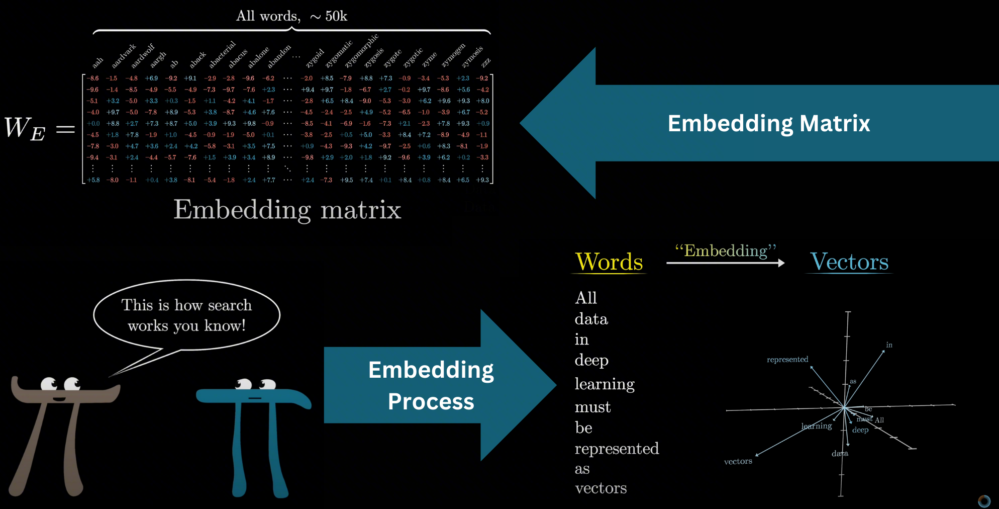
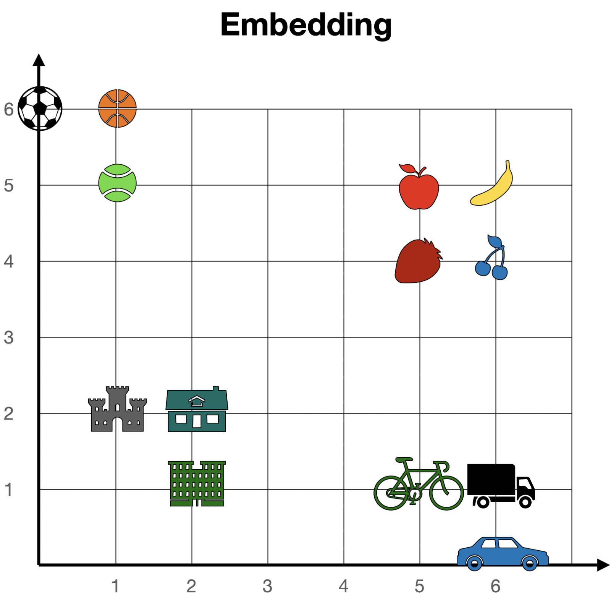
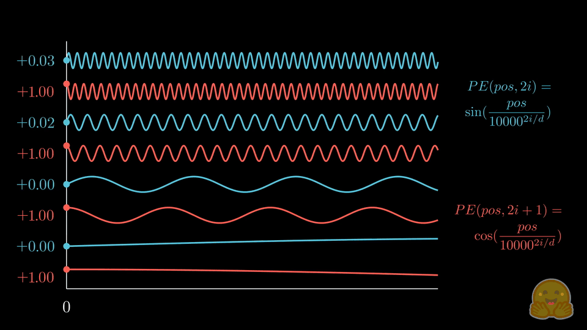

# 从零实现 Transformer（二）：数据处理与 Transformer 输入层

> 上一篇我们掌握了 PyTorch 的基础操作，本篇带你逐行手写从原始文本到模型输入的完整流水线——一句 `I love deep learning` 在进入 Transformer 之前，会被切碎、编号、填充、升维、注入位置。写完这些代码，你就亲手打通了 Transformer 的"感官系统"。

## 系列目录

1. [PyTorch 基础与神经网络模块](01-pytorch-basics.md)
2. **数据处理与 Transformer 输入层**（本篇）
3. [多头注意力机制与核心组件](03-multi-head-attention.md)
4. [Transformer 模型组装](04-transformer-assembly.md)
5. [训练、推理与可视化](05-training-and-inference.md)

---

## 本篇流水线全景

本篇覆盖下图中从原始文本到模型输入的全部环节。每一节对应一个阶段，建议对照此图阅读：

```
原始文本 ──→ 分词 ──→ 词表索引 ──→ Padding对齐
 (§1)        (§1)       (§1)            (§2)
──→ Token Embedding ──→ ×√d_model
      (§3)                  (§3.2)
──→ + 位置编码 ──→ Dropout ──→ 模型输入
       (§4)          (§5)       (§5)
```

---

## 1. 构建迷你翻译数据集和词表

我们先造一个 5 句话的迷你翻译数据集，目的不是翻译准确，而是看清每个 Token 的完整旅程。之后你就理解了——大模型按 Token 计费，因为 **Token 才是计算原子**。


<center>图源：https://luxiangdong.com/2023/04/19/transformer/</center>

**原始数据与词表构建**

```python
# 构建原始数据集，source 是英文，target 是中文
raw_data = [
    ("I love deep learning", "我爱深度学习"),
    ("Transformer is all you need", "你需要的就是变形金刚"),
    ("Attention mechanism is great", "注意力机制很棒"),
    ("hello world", "你好世界"),
    ("PyTorch is easy to learn", "PyTorch很容易学")
]

# 构建词表
# pad: 填充, sos: 开始, eos: 结束
src_vocab = {'<pad>': 0, '<sos>': 1, '<eos>': 2}
tgt_vocab = {'<pad>': 0, '<sos>': 1, '<eos>': 2}

# 扫描数据集，构建词表
for src, tar in raw_data:
    for word in src.split():      # 英文用空格分词
        if word not in src_vocab:
            src_vocab[word] = len(src_vocab)
    for word in tar:              # 中文按单个字符遍历
        if word not in tgt_vocab:
            tgt_vocab[word] = len(tgt_vocab)

# 创建反向词表（索引 → 单词）
idx2src = {v: k for k, v in src_vocab.items()}
idx2tar = {v: k for k, v in tgt_vocab.items()}

print(f"源语言词表大小: {len(src_vocab)}")
print(f"目标语言词表大小: {len(tgt_vocab)}")
```

??? question "📖 为什么词表中需要 `<pad>`, `<sos>`, `<eos>` 三个特殊 token？能不能只保留一个？"

    **不能。** 三者角色是不一样的：

    - `<pad>`：填充短序列到末尾保证 batch 统一长度，后续会被 attention mask 屏蔽，不参与实际计算
    - `<sos>`：告诉 Decoder "开始生成"，它是 Decoder 推理时的第一个输入 token
    - `<eos>`：告诉模型 "到此结束"，推理时生成 `<eos>` 就停止

**关于词表大小**：给大家一个数字感受下。英文日常交流使用 3000-4000 个单词就可以覆盖 90% 的口语场景，常用的汉字大概在 3000-5000 个之间。

| 维度 | 英文 | 中文 |
|------|------|------|
| 人类常用基础单元 | ~20,000 单词（大学水平） | ~3,500 汉字（常用字） |
| 人类常用词汇/短语 | ~50,000（韦氏基础词） | ~56,000 常用词（现代汉语词表） |

GPT-3 使用约 50K 的词表（主要英文），Qwen3 已经扩展到 150K（中英文），GPT-4o 更是 200K。词表越大，训练数据量也越大。

现在每个 token 有了自己的编号。但问题来了——句子长短不一，怎么喂给模型？

---

## 2. Dataset 与 DataLoader（Padding）

??? question "📖 怎么把长短不一的句子塞到同一个 Batch 中呢？"

    **把短句末尾补 0 到统一长度，后续用 mask 告诉模型忽略这些填充位。** 这就像考试时答题卡设计为有 50 个格子，卷子只有 30 道题，你也只写了 30 个答案，剩下 20 个空着——阅卷机器会自动跳过空格。

### 2.1 自定义 Dataset

```python
class ToyTranslationDataset(data.Dataset):
    def __init__(self, data, src_vocab, tgt_vocab):
        self.data = data
        self.src_vocab = src_vocab
        self.tgt_vocab = tgt_vocab

    def __len__(self):
        return len(self.data)

    def __getitem__(self, idx):
        src_text, tgt_text = self.data[idx]
        # 查找每个 token 在词表中的索引
        src_indices = [self.src_vocab[word] for word in src_text.split()]
        tgt_indices = [self.tgt_vocab[word] for word in tgt_text]
        return torch.tensor(src_indices), torch.tensor(tgt_indices)
```

### 2.2 Collate 函数与 Padding

神经网络要求输入是规整的矩阵，不能是长度参差不齐的列表。

```python
def collate_fn(batch):
    """自定义 batch 处理：补前后标识 + 补 0"""
    src_batch, tgt_batch = [], []

    for src_sample, tgt_sample in batch:
        src_batch.append(src_sample)
        # 目标序列拼上 <sos> 和 <eos>
        tgt_processed = torch.cat([
            torch.tensor([tgt_vocab['<sos>']]),
            tgt_sample,
            torch.tensor([tgt_vocab['<eos>']])
        ])
        tgt_batch.append(tgt_processed)

    # padding_value=0 就是词表中的 <pad>
    src_batch = nn.utils.rnn.pad_sequence(src_batch, padding_value=0, batch_first=True)
    tgt_batch = nn.utils.rnn.pad_sequence(tgt_batch, padding_value=0, batch_first=True)
    return src_batch, tgt_batch


dataset = ToyTranslationDataset(raw_data, src_vocab, tgt_vocab)
loader = data.DataLoader(dataset, batch_size=2, shuffle=False, collate_fn=collate_fn)

src_batch, tgt_batch = next(iter(loader))

print("处理后 Batch 数据的形状")
print(f"Source Batch Shape: {src_batch.shape}  (Batch, Src_len)")
print(f"Target Batch Shape: {tgt_batch.shape}  (Batch, tgt_len)")
print("\nSource:\n", src_batch)
print("Target:\n", tgt_batch)
```

**解读**：batch=2，源数据（英文）一个长度为 4，一个长度为 5，短的句子最后补 0。目标数据加了 `<sos>` 和 `<eos>`，最长的句子长度比原来多了 2，其他句子也补 0 到同一长度。

??? question "📖 `pad_sequence` 和 `collate_fn` 各自承担什么职责？为什么不能只用其中一个？"

    协作关系：`collate_fn` 是 DataLoader 的"组装车间主任"，它负责拿到一个 batch 的样本列表后，先将 src 和 tgt 分别收集，再分别调用 `pad_sequence` 进行填充对齐，最终输出 `(src_batch, tgt_batch)` 两个对齐的张量。两者是流程编排与具体操作的关系。

Padding 让数据对齐了，但每个 token 还只是一个光秃秃的整数索引。接下来给它们"长肉"。

---

## 3. 词嵌入（Token Embedding）

经过 DataLoader，我们已经把人类的语言初步转换成了数字（每个 Token 对应一个词表 Index）。

??? question "📖 我们能直接用这些 Index 去训练吗？这也是数字对吧，计算机也能理解。"

    **不能。** 类比一下：老师给你布置了一本寒假作业，只给了你目录，让你把整本作业连题目带答案都写出来——信息太少了。

    我们需要**把词扩展到更高维度**，让这个词在现实生活中的众多含义都能被数字表示。比如"香蕉"的含义有水果、黄色、热带、弯的等等，一个编号装不下这些。Index 是给每个 token 一个"身份证号"，Embedding 给每个 token 一张"个人简历"，更多维度，每一维描述一个语义特征。

    | 整数索引 | Embedding 向量 |
    |---------|--------------|
    | 1 维，只有"编号"信息 | 高维（128-2048 维），每个维度都可以编码不同的语义特征 |
    | 无法表达词与词之间的相似度 | 向量距离天然反映语义距离（如 `king - man + woman ≈ queen`） |



<center>图源：https://www.3blue1brown.com/lessons/gpt</center>

上图左上角是一个 Embedding 矩阵，右下角演示了一些词汇如何用 Embedding 向量表示，仅仅是高维映射到低维的一个演示。下图更贴切地展示了某些有相似含义的 Embedding 向量会聚集在一起，如球类、水果、交通工具、建筑物等。



<center>图源：https://luxiangdong.com/2023/04/19/transformer/</center>

理解了为什么需要 Embedding，我们来看它的实现——其实就是查表。

### 3.1 Embedding 的本质就是查表

```python
# 词表大小 10，向量维度 4
emb_layer = nn.Embedding(num_embeddings=10, embedding_dim=4)

print("Embedding 权重矩阵形状：", emb_layer.weight.shape)  # (10, 4)

input_ids = torch.tensor([3, 0, 7])
outputs = emb_layer(input_ids)

print(f"输出形状: {outputs.shape}")  # (3, 4)

# 验证：Embedding 本质就是查表
print(torch.equal(emb_layer.weight.data[3], outputs.data[0]))  # True
```

验证完了原理，接下来让 token 升维到高维空间，让它能更完整地表示自己。


<center>图源：https://luxiangdong.com/2023/04/19/transformer/</center>

`nn.Embedding(vocab_size, emb_size)` 就是一张 `vocab_size × emb_size` 的查找表。在早期 NLP 中（如使用 Word2Vec 的时代），这张表通常由单独的 Embedding 模型预训练好后冻结使用，不随下游模型更新。但在现代 Transformer 架构中，这张表默认是随模型一起训练的。

你可能注意到代码里还有个 `d_model`——它和 `emb_size` 是同一个值，只是视角不同：`emb_size` 是 Embedding 层的设计参数，`d_model` 是整个模型的数据通道宽度。

### 3.2 缩放因子

论文中有一个 `Embedding * sqrt(d_model)` 的操作。为什么？为了让语义信息给予更大的权重，Embedding 的初始化标准差约 `1/√d_model`，乘以 `√d_model` 后拉到标准差 ≈ 1，和位置编码（范围 [-1,1]）在同一量级，避免被位置信息"功高盖主"。

打个比方：你喝一杯咖啡，浓缩咖啡+水（语义向量 × √d_model）配糖浆（位置编码），风味层次分明；要是浓缩咖啡直接加糖浆（语义向量 + 位置编码），喝到的就是一杯奇怪的饮料。

```python
d_model = 512
emb_large = nn.Embedding(100, d_model)
sample = emb_large(torch.tensor([1]))

print(f"未缩放的标准差：{sample.std().item():.4f}")          # ≈ 1.0
sample_scaled = sample * math.sqrt(d_model)
print(f"缩放后的标准差：{sample_scaled.std().item():.4f}")    # ≈ 22.6
print(f"缩放因子 sqrt({d_model}) = {math.sqrt(d_model):.2f}")
```

我们会在第 5 节的代码中看到这个缩放操作。

到此为止，每个 Token 已经有了丰富的语义向量——但模型还不知道它们的**顺序**。

---

## 4. 位置编码（Positional Encoding）

??? question "📖 数据不就是按顺序排列的吗？为什么还要加位置信息？"

    好问题！如果是串行读的模型（像 RNN、LSTM），模型确实可以根据读入顺序推断，但那样**太慢了**。Transformer 是**一次性并行处理所有 token** 的，所以没有位置编码的话，`I love you` 和 `Love I you` 对它来说一模一样。

**位置编码公式**

$$PE_{(pos, 2i)} = \sin(pos / 10000^{2i/d_{model}})$$

$$PE_{(pos, 2i+1)} = \cos(pos / 10000^{2i/d_{model}})$$

> 推荐 B 站视频讲解（只有 10 分钟）：https://b23.tv/qpalhST
>
> 一句话理解：基于 sin 和 cos 的周期性质，通过叠加不同尺度的正弦余弦来对位置编码，值范围控制在固定范围方便归一化，且任意 pos+K 的编码都能通过 pos 的编码线性推导获得。



<center>图源：https://huggingface.co/blog/zh/designing-positional-encoding</center>

**手动推导（简化版）**

以 `max_len=4, d_model=8` 为例：

```
position × div_term:
pos=0: [0.0,  0.0,  0.0,   0.0  ]
pos=1: [1.0,  0.1,  0.01,  0.001]
pos=2: [2.0,  0.2,  0.02,  0.002]
pos=3: [3.0,  0.3,  0.03,  0.003]
```

偶数位用 sin，奇数位用 cos，交错拼接后：

```
列:     sin₀   cos₀   sin₁   cos₁   sin₂   cos₂   sin₃   cos₃
pos=0: [ 0.0,   1.0,   0.0,   1.0,   0.0,   1.0,   0.0,   1.0 ]
pos=1: [ 0.84,  0.54,  0.10,  0.99,  0.01,  1.0,   0.001, 1.0 ]
pos=2: [ 0.91, -0.42,  0.20,  0.98,  0.02,  1.0,   0.002, 1.0 ]
pos=3: [ 0.14, -0.99,  0.30,  0.96,  0.03,  1.0,   0.003, 1.0 ]
```

左边的列频率高，不同位置差异明显（秒针）；右边的列频率低，差异较小（时针）。通过不同频率的组合，可以为每个位置生成唯一的"位置指纹"。

??? question "📖 那位置会不会有重复？"

    单个维度是周期性的，但所有不同频率组合的最小公倍数趋于无穷大（周期是无理数），所以对于我们的小模型完全够用。新的大模型有更先进的位置编码方案（如 RoPE）。就像一个钟表的时针和分针，如果分针每 60 分钟转一圈，时针每 60√2 分钟转一圈，它们永远不会回到完全相同的组合位置。

**代码实现**

```python
class PositionalEncoding(nn.Module):
    def __init__(self, d_model, max_len=5000):
        super(PositionalEncoding, self).__init__()

        pe = torch.zeros(max_len, d_model)
        position = torch.arange(0, max_len, dtype=torch.float).unsqueeze(1)
        # 等价于 10000^(2i/d_model)，用 exp+log 变换是为了数值稳定性
        div_term = torch.exp(torch.arange(0, d_model, 2).float() * (-math.log(10000.0) / d_model))

        pe[:, 0::2] = torch.sin(position * div_term)  # 偶数下标用 sin
        pe[:, 1::2] = torch.cos(position * div_term)  # 奇数下标用 cos
        pe = pe.unsqueeze(0)  # (1, max_len, d_model)
        # register_buffer：告诉 PyTorch "这个张量随模型保存/加载，但不参与梯度更新"
        self.register_buffer('pe', pe)  # 不需要学习的参数

    def forward(self, x):
        x = x + self.pe[:, :x.size(1), :]
        return x
```

**Forward 推导**

假设 `x` 的 shape 是 `(32, 50, 512)` (batch=32, seq_len=50, d_model=512)：

```
self.pe 的 shape: (1, 5000, 512)
截取: self.pe[:, :50, :] → (1, 50, 512)
相加: x + self.pe[:, :50, :] → (32, 50, 512)  # batch 维度广播
```

位置编码和句子的具体内容无关——这是很自然的认知。"你爱我"、"我爱你"、"蜜雪冰城甜蜜"，第一个字都处于句首位置，理应都用 index=0 的位置编码。

---

## 5. 组合 Embedding + Positional Encoding

将 Embedding 层和位置编码层封装为一个完整的输入层，就能将一段原始数据整合为语义信息+位置信息都包含的一组向量了：


<center>图源：https://luxiangdong.com/2023/04/19/transformer/</center>

```python
class TokenEmbedding(nn.Module):
    def __init__(self, vocab_size, emb_size):
        super(TokenEmbedding, self).__init__()
        self.embedding = nn.Embedding(vocab_size, emb_size)
        self.emb_size = emb_size

    def forward(self, tokens):
        return self.embedding(tokens.long()) * math.sqrt(self.emb_size)


class TransformerInputLayer(nn.Module):
    def __init__(self, vocab_size, emb_size, max_len=5000, dropout=0.1):
        super().__init__()
        self.token_emb = TokenEmbedding(vocab_size, emb_size)
        self.pos_emb = PositionalEncoding(emb_size, max_len)
        self.dropout = nn.Dropout(dropout)

    def forward(self, x):
        out = self.token_emb(x)
        out = self.pos_emb(out)
        return self.dropout(out)
```

**关于 Dropout**：训练时随机将一部分维度置零，迫使模型不依赖任何单一特征——这是最简单有效的正则化手段。推理时自动关闭，不影响输出。

**完整 Shape 追踪**：

```
输入 token indices: (B, S)           ← 例如 (2, 5)，2 个句子，最长 5 个 token
    ↓ TokenEmbedding 查表
嵌入向量:           (B, S, D)         ← (2, 5, 512)
    ↓ × √d_model 缩放
缩放后:             (B, S, D)         ← 数值放大，shape 不变
    ↓ + PositionalEncoding
加位置编码:         (B, S, D)         ← 语义 + 位置，shape 不变
    ↓ Dropout
最终输出:           (B, S, D)         ← 这就是送入 Encoder/Decoder 的输入
```

??? question "📖 假设 d_model=8, batch_size=2, 源语言序列为 [\"I love ML\", \"Hi\"]。从词汇表索引到最终 TransformerInputLayer 输出，请描述数据在每一步的 shape 变化？"

    假设词汇表：`<pad>:0, <sos>:1, <eos>:2, I:3, love:4, ML:5, Hi:6`

    **Step 1：Token 化 + Padding**

    ```
    seq1: [3, 4, 5]  → 长度 3
    seq2: [6]        → 长度 1
    pad → [[3, 4, 5],
           [6, 0, 0]]
    ```

    Shape: `(2, 3)` — int64 索引张量

    **Step 2：Token Embedding**

    ```python
    emb = nn.Embedding(7, 8)  # vocab_size=7, d_model=8
    x = emb(input_ids)        # (2, 3) → (2, 3, 8)
    ```

    Shape: `(2, 3, 8)` — 每个 token 变成 8 维向量

    **Step 3：Scaling**

    ```python
    x = x * math.sqrt(8)      # ≈ x * 2.828
    ```

    Shape 不变: `(2, 3, 8)`，但数值放大约 2.83 倍

    **Step 4：Positional Encoding**

    ```python
    x = x + pe[:, :3, :]      # pe shape: (1, max_len, 8) → 广播为 (2, 3, 8)
    ```

    Shape 不变: `(2, 3, 8)`，每个位置加上对应的位置编码

    **Step 5：Dropout**

    ```python
    x = dropout(x)             # 训练时随机置零部分元素
    ```

    Shape 不变: `(2, 3, 8)`，这就是最终输出

---

## 小结

本篇我们完成了 Transformer 的"感官系统"：

- **词表构建**：将文本转换为数字索引
- **Dataset & DataLoader**：处理变长序列的 Padding 策略
- **Token Embedding**：将一维索引映射到高维向量空间
- **Positional Encoding**：用正弦余弦函数为每个位置生成唯一编码
- **输入层组合**：Embedding + 位置编码 + Dropout

逐行写完上面的代码、运行无报错，就可以进入下一篇——**手写多头注意力机制**。那里才是 Transformer 真正的"灵魂"：你会发现，注意力机制本质上只做了一件事——让每个 token 去"找朋友"。

---

## 进阶：从正弦 PE 到 RoPE

主流大模型（LLaMA、Qwen 等）已转向 RoPE（旋转位置编码），但正弦 PE 仍是理解位置编码概念的最佳起点。

有兴趣的可以阅读 [HuggingFace 位置编码设计博客](https://huggingface.co/blog/zh/designing-positional-encoding) 中的"旋转位置编码 (RoPE)"章节，以及 [B 站视频讲解](https://www.bilibili.com/video/BV1CQoaY2EU2/)。

**课后思考：正弦 PE 的三个局限性**

1. **绝对位置 vs 相对位置**：理论上正弦编码已将相对位置编码在向量中，模型可以自行"学会"其中的相对位置关系。但 RoPE 是显式注入相对位置的，无需依赖模型是否能学到。
2. **加法注入 vs 旋转注入**：PE 通过加法与 Embedding 结合，位置信息和语义信息共享同一向量空间，可能互相干扰。RoPE 通过旋转变换注入，理论上不改变向量的模长，位置耦合更优雅。
3. **长度外推能力有限**：虽然周期函数理论上可外推，但超出训练长度后性能仍会下降，现代方案（如 ALiBi、YaRN）都做了专门优化。

---

上一篇：[<< PyTorch 基础与神经网络模块](01-pytorch-basics.md)

下一篇：[多头注意力机制与核心组件 >>](03-multi-head-attention.md)

---

## 参考文章

**Tokenizer**

- [ByteTech - Tokenizer 详解](https://bytetech.info/articles/7584656121341444150)

**位置编码**

- [HuggingFace - 设计位置编码](https://huggingface.co/blog/zh/designing-positional-encoding)
- [ByteTech - 位置编码专题](https://bytetech.info/articles/7587029468749758527)

**Transformer 原理**

- [Transformer 模型详解（图解最完整版）](https://zhuanlan.zhihu.com/p/338817680)
- [三万字最全解析！从零实现 Transformer](https://zhuanlan.zhihu.com/p/648127076)
- [解剖注意力：从零构建 Transformer 的终极指南](https://zhuanlan.zhihu.com/p/1984265632687087772)
- [Transformer 教程 - luxiangdong](https://luxiangdong.com/2023/04/19/transformer/)

**实操教程**

- [LLMs-from-scratch (GitHub)](https://github.com/rasbt/LLMs-from-scratch)
- [llms-from-scratch-cn (Datawhale 中文版)](https://github.com/datawhalechina/llms-from-scratch-cn)
