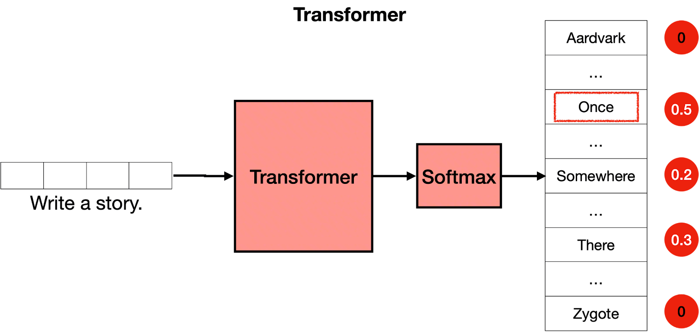
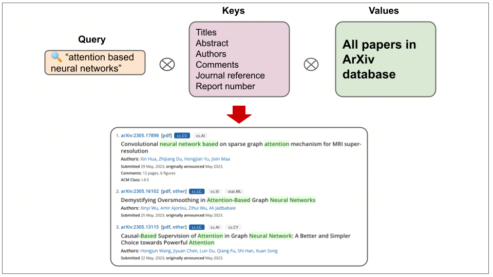
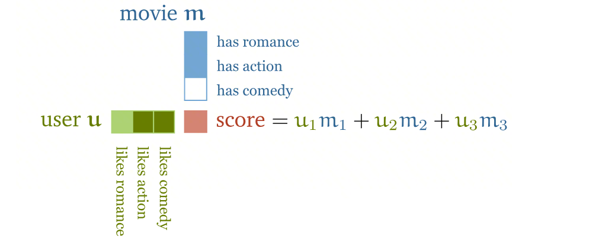
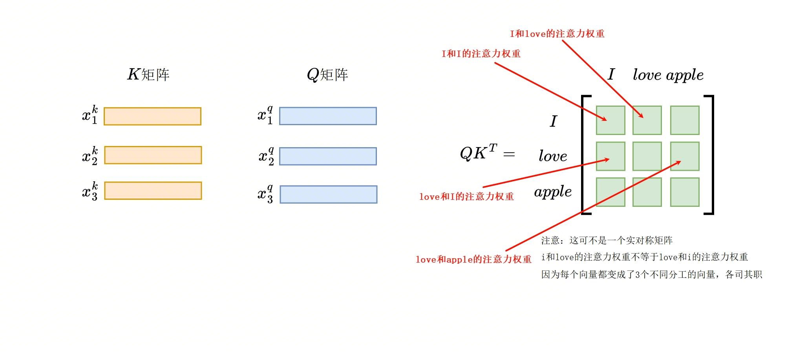
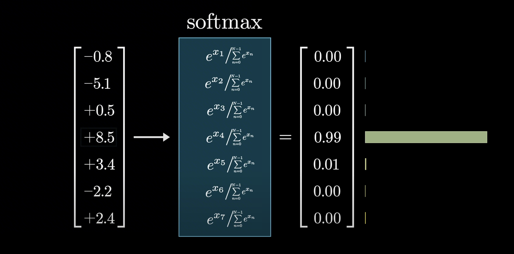
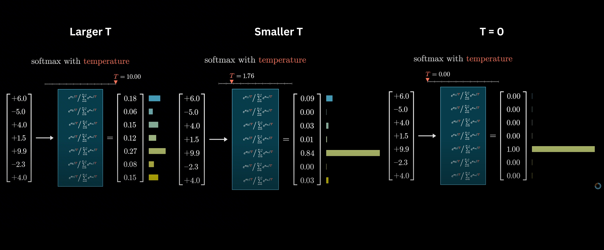
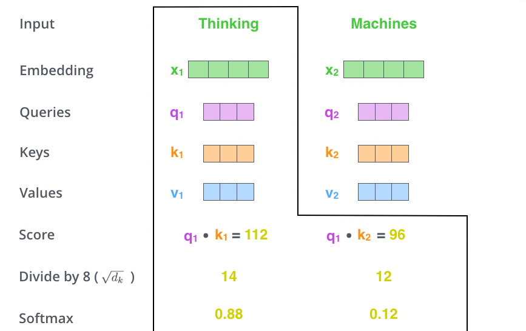
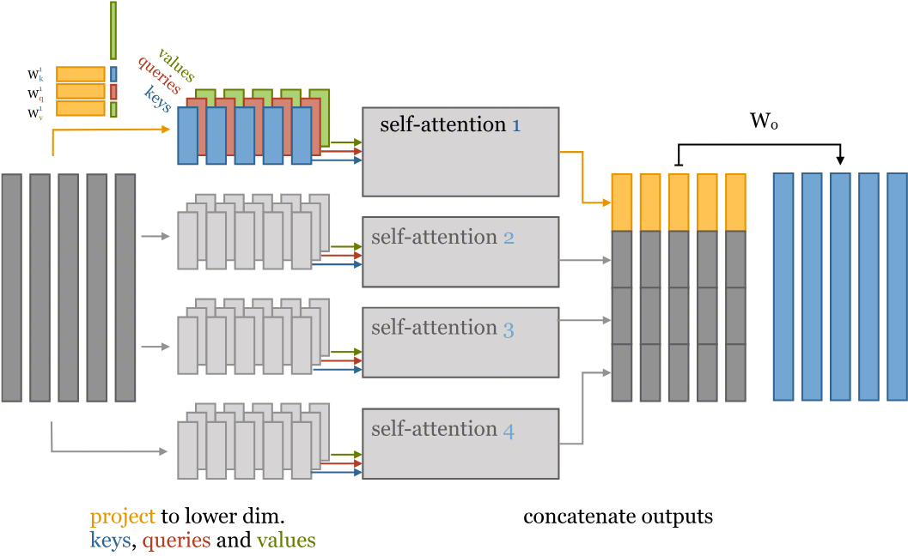

# 动手学AI ⚡️ 手写Transformer 03：多头注意力机制与核心组件

> 上一篇我们把人类的句子变成了 `(Batch, Seq_len, Dim)` 的张量，现在我们要创建 Transformer 的大脑——多头注意力机制，让它能学习知识，本章介绍如何搭建 Encoder 和 Decoder 的核心组件。

## 系列目录

1. [环境与前期准备](01-pytorch-basics.md)
2. [数据处理与 Transformer 输入层](02-data-and-input-layer.md)
3. **多头注意力机制与核心组件**（本篇）
4. [模型组装](04-transformer-assembly.md)
5. [训练、推理与可视化](05-training-and-inference.md)

---

## 1. 什么是注意力机制？

先从全局看一下 Transformer 在干什么——数据经过 Transformer 核心处理后，再通过 Softmax 输出各类别的概率分布：



<center>图源：https://luxiangdong.com/2023/04/19/transformer/</center>

Transformer 就像一个两步走的决策过程。第一步，数据被送进一个非常聪明的"思考机器"（Transformer），它会深入分析数据并得出一堆初步结论。第二步，这些结论被送进一个"决策转换器"（Softmax），它把复杂的结论转换成简单明了的百分比概率，告诉你最终结果属于每个类别的可能性有多大。

### 1.1 核心公式

$$\text{Attention}(Q, K, V) = \text{softmax}\left(\frac{QK^T}{\sqrt{d_k}}\right)V$$

### 1.2 QKV 直觉理解



<center>图源：https://luxiangdong.com/2023/09/10/trans/</center>

上图把 AI 的"注意力"比作在图书馆网站上查资料。你想找什么（**Query**，你的搜索词），就去和所有书的"索引卡片"（**Keys**，书名、作者等）做对比。找到最匹配的几张卡片后，你就可以根据这些卡片去书架上取出对应的"书本"（**Values**，论文全文）。

### 1.3 计算过程

**第一步：Q @ K^T —— 算相关性分数**

用问题和所有词条做点积，算出相关性分数。为什么点积能衡量相关性？看下面这个例子：



<center>图源：https://peterbloem.nl/blog/transformers</center>

上图在微观层面用推荐系统来解释点积。系统把你和一部电影都用一组标签来描述（比如你有多喜欢喜剧，这部电影有多少喜剧成分），然后将对应标签的分数相乘再加起来，得到一个总分。分数越高，说明你和这部电影越"合拍"。



<center>图源：https://zhuanlan.zhihu.com/p/1984265632687087772</center>

上图演示了注意力分数计算过程，对于句子 I love apple，AI 会创建一个表格，每个格子的数值代表一个词对另一个词的"关注"程度。这个表格帮助 AI 理解哪个词和哪个词的联系更紧密。

**第二步：/ √d_k —— 缩放**

维度 d_k 越大，点积绝对值越大，会导致 softmax 接近 one-hot（梯度消失）。看个对比：

| 输入 | softmax 输出 | 特征 |
|------|------------|------|
| `[1, 2, 3]` | `[0.09, 0.24, 0.67]` | 分布均匀，梯度正常 |
| `[10, 20, 30]` | `[0.00, 0.00, 1.00]` | 接近 one-hot，梯度几乎为 0 |

除以 √d_k 就是把分数拉回到合理范围，防止 softmax "太自信"。

**第三步：softmax —— 归一化为概率分布**

Softmax 把分数归一化为概率分布（加起来等于 1）。它的直觉可以参考 [3Blue1Brown 关于 GPT 的讲解](https://www.3blue1brown.com/lessons/gpt)：



<center>图源：https://www.3blue1brown.com/lessons/gpt</center>

想象你在给几个选项打分，分数有正有负。Softmax 就像一个"选择放大器"，它会把你的原始分数转换成百分比概率，把分数最高的那个（这里是 `+8.5`）的概率变得非常高（`99%`），而其他选项的概率则变得微不足道。

Softmax 还有一个重要参数——**温度（Temperature）**：



<center>图源：https://www.3blue1brown.com/lessons/gpt</center>

你可以把"温度"想象成 AI 的"决策自信度旋钮"。当温度很高时（左图），AI 会变得犹豫不决，觉得每个选项都有点可能。当温度降低时（中图），它会更倾向于那个最好的选项。当温度为零时（右图），AI 会变得极度自信，100% 确定地选择那个分数最高的选项。

**第四步：@ V —— 加权求和**

用概率对所有内容做加权求和——关注度高的词贡献更多信息，关注度低的词贡献更少。

??? question "📖 注意力机制的计算复杂度是多少？为什么长序列是瓶颈？"

    标准自注意力的总复杂度为 $O(n^2 \cdot d)$，与序列长度的平方成正比：

    - 序列长 512 → 矩阵 512×512 ≈ 26 万元素
    - 序列长 4096 → 矩阵 4096×4096 ≈ 1677 万元素（增长 64 倍）
    - 序列长 100K → 不可行

    这就是为什么 FlashAttention、Sparse Attention、Linear Attention 等高效注意力机制是活跃的研究方向。

### 1.4 多头的直觉

把 QKV 拆分成多个"头"（比如 8 个），相当于让模型有 8 个不同的大脑：

- 有的学习语法
- 有的学习语义
- 有的学习指代关系

最后把所有头拼接到一起，综合全部专家建议。

??? question "📖 多头注意力的"拆分+拼接"与独立计算为什么等价？参数量为什么不变？"

    **单头注意力参数量**：$W^Q, W^K, W^V \in \mathbb{R}^{d \times d}$，加上 $W^O$，共 $4d^2$。

    **多头注意力参数量**：$h$ 个头，$d_k = d/h$，每个头 $W_i^Q, W_i^K, W_i^V \in \mathbb{R}^{d \times d_k}$，$h$ 个头总计 $3 \times h \times d \times d/h = 3d^2$，加 $W^O$ 仍为 $4d^2$，**参数量完全相同**。

---

## 2. 多头注意力机制实现

先看图理解整个流程，再看代码实现。



<center>图源：https://jalammar.github.io/images/t/transformer_self-attention_visualization.png</center>

**单头注意力计算流程**——这张图展示了如何决定"Thinking"这个词应该多关注自己以及多关注"Machines"。分步进行：首先计算"相关性"原始分，然后缩放，最后转换成"关注度百分比"（88% 和 12%）。



<center>图源：https://peterbloem.nl/blog/transformers</center>

**多头注意力并行机制**——这就像让一个专家组（而不是一个人）来分析一句话。每个专家（一个"头"）都有自己的专长，会从不同角度（语法、词义等）来分析句子。他们各自独立工作，最后把所有结论汇总起来，得到一个远比单个专家更全面的理解。

理解了流程，来看代码：

```python
import torch
import torch.nn as nn
import torch.nn.functional as F
import math


class MultiHeadAttention(nn.Module):
    def __init__(self, d_model, num_heads):
        super(MultiHeadAttention, self).__init__()
        assert d_model % num_heads == 0, "d_model 必须能被 num_heads 整除"

        self.d_k = d_model // num_heads  # 每个头的维度，如 512 / 8 = 64
        self.n_heads = num_heads
        self.d_model = d_model

        # 定义 QKV 的权重矩阵
        self.w_q = nn.Linear(d_model, d_model)
        self.w_k = nn.Linear(d_model, d_model)
        self.w_v = nn.Linear(d_model, d_model)
        self.fc = nn.Linear(d_model, d_model)

    def forward(self, q, k, v, mask=None):
        batch_size = q.size(0)

        # 线性变换 + 拆分头
        # (Batch, Len, D_model) → (Batch, Len, n_head, d_k) → (Batch, n_head, Len, d_k)
        Q = self.w_q(q).view(batch_size, -1, self.n_heads, self.d_k).permute(0, 2, 1, 3)
        K = self.w_k(k).view(batch_size, -1, self.n_heads, self.d_k).permute(0, 2, 1, 3)
        V = self.w_v(v).view(batch_size, -1, self.n_heads, self.d_k).permute(0, 2, 1, 3)

        # 计算点积注意力
        # Q: (Batch, n_head, Len, d_k), K^T: (Batch, n_head, d_k, Len)
        # scores: (Batch, n_head, Len, Len)
        scores = torch.matmul(Q, K.transpose(-2, -1)) / math.sqrt(self.d_k)

        # 应用 mask，这个 mask 可以先忽略，后面会讲
        if mask is not None:
            scores = scores.masked_fill(mask == 0, -1e9)

        attn = F.softmax(scores, dim=-1)

        # 加权求和
        context = torch.matmul(attn, V)

        # 拼接多个头
        context = context.permute(0, 2, 1, 3).contiguous().view(batch_size, -1, self.d_model)
        output = self.fc(context)
        return output, attn
```

**测试**

```python
d_model = 512
num_heads = 8
mha = MultiHeadAttention(d_model, num_heads)

x = torch.randn(2, 10, 512)  # (batch, seq_len, dim)
out, attn_map = mha(x, x, x, mask=None)

print(f"Input:  {x.shape}")           # (2, 10, 512)
print(f"Output: {out.shape}")          # (2, 10, 512)
print(f"Attention Map: {attn_map.shape}")  # (2, 8, 10, 10)
```

**维度解读**：

- `(2, 8, 10, 10)` — 第 2 个样本、第 8 个头中，Q 的第 i 个位置对 K 的第 j 个位置的注意力分数

??? question "📖 attn[0, 3, 5, 7] 表示什么？"

    `attn[0, 3, 5, 7]` = **第 1 个样本**（索引 0）、**第 4 个头**（索引 3）中，**Q 的第 6 个位置**（索引 5）对 **K 的第 8 个位置**（索引 7）的注意力权重。该值经过 softmax，在 [0,1] 之间，表示"在第 4 个头的视角下，第 6 个 token 有多关注第 8 个 token"。

---

## 3. 前馈神经网络（FFN）

每个 Encoder/Decoder 层中，除了 Attention，还有一个前馈网络：

```python
class FFN(nn.Module):
    def __init__(self, d_model, d_ff, dropout=0.1):
        super(FFN, self).__init__()
        self.linear1 = nn.Linear(d_model, d_ff)
        self.linear2 = nn.Linear(d_ff, d_model)
        self.dropout = nn.Dropout(dropout)

    def forward(self, x):
        return self.linear2(self.dropout(F.relu(self.linear1(x))))
```

FFN 的作用是增加模型的非线性能力，`d_ff` 通常是 `d_model` 的 4 倍（如 512 → 2048）。

---

## 4. 残差连接与层归一化

在 Transformer 中，每个子层的输出都要经过 **Add & Norm** 操作。

### 4.1 残差连接

名字很高大上，实现很简单：**把输入和子层输出直接相加**。

```python
residual = x + sublayer_output
```

### 4.2 层归一化（LayerNorm）

本质就是：`输出 = (x - 均值) / 标准差`，把数据拉到均值 0、方差 1 的范围。

**LayerNorm vs BatchNorm 的区别在于：沿哪个方向算均值和标准差。**

```
数据矩阵 (batch=3, features=4):

         特征1  特征2  特征3  特征4
句子1  [  -    -    -    -  ]  ← LayerNorm: 沿这个方向算
句子2  [  -    -    -    -  ]  ← LayerNorm: 沿这个方向算
句子3  [  -    -    -    -  ]  ← LayerNorm: 沿这个方向算
         |    |    |    |
         BatchNorm: 沿这个方向算
```

```python
x = torch.tensor([[[1.0, 2.0, 3.0, 4.0],
                    [5.0, 6.0, 7.0, 8.0],
                    [9.0, 10., 11., 12.]],
                   [[0.1, 0.2, 0.3, 0.4],
                    [0.5, 0.6, 0.7, 0.8],
                    [0.9, 1.0, 1.1, 1.2]]])

layer_norm = nn.LayerNorm(4)
output = layer_norm(x)

print(f"归一化前均值：{x[0,0,:].mean():.4f}")      # 2.5000
print(f"归一化后均值：{output[0,0,:].mean():.4f}")   # 0.0000
```

??? question "📖 LayerNorm 和 BatchNorm 的归一化方向有什么不同？为什么 Transformer 选择 LayerNorm？"

    - **BatchNorm**：沿 batch 维度归一化——对同一特征，在所有样本上计算均值和方差
    - **LayerNorm**：沿特征维度归一化——对同一样本，在所有特征上计算均值和方差

    Transformer 选择 LayerNorm 的原因：

    1. **序列长度可变**：NLP 中每个 batch 的序列长度不同，BatchNorm 需要对齐长度或处理 padding
    2. **小 batch 问题**：大模型训练中 batch size 可能很小（甚至为 1），BatchNorm 统计量不稳定
    3. **推理一致性**：LayerNorm 不依赖 batch 统计量，训练和推理行为完全一致

### 4.3 Norm 的位置

| 方案 | 公式 | 说明 |
|------|------|------|
| Post-Norm（原始论文） | `x = Norm(x + SubLayer(x))` | 先计算，再归一化 |
| Pre-Norm（后来主流） | `x = x + SubLayer(Norm(x))` | 先归一化，再计算 |

Pre-Norm 训练更稳定，是现代 Transformer 的主流选择。本教程先用 Post-Norm 方便对照论文。

---

## 5. 组装 Encoder Layer

有了 Attention、FFN、LayerNorm、残差连接，我们就能搭建 Encoder 的一层积木了：

**Encoder = Self-Attention + Add & Norm + FFN + Add & Norm**

```python
class EncoderLayer(nn.Module):
    def __init__(self, d_model, num_heads, d_ff, dropout=0.1):
        super().__init__()
        self.self_attention = MultiHeadAttention(d_model, num_heads)
        self.ffn = FFN(d_model, d_ff, dropout)
        self.norm1 = nn.LayerNorm(d_model)
        self.norm2 = nn.LayerNorm(d_model)
        self.dropout = nn.Dropout(dropout)

    def forward(self, x, mask):
        attn_output, _ = self.self_attention(x, x, x, mask)
        x = self.norm1(x + self.dropout(attn_output))

        ffn_output = self.ffn(x)
        x = self.norm2(x + self.dropout(ffn_output))
        return x
```

---

## 6. 组装 Decoder Layer

Decoder 稍微复杂一点，有**三个子层**：

1. **Masked Self-Attention**：掩码防止看到未来信息，下一章会详细讲这两个 mask 如何构造
2. **Cross-Attention**：Q 来自 Decoder，K 和 V 来自 Encoder
3. **FFN**：和之前一样

Decoder 的两个注意力层分别需要不同的 mask：自注意力需要**因果掩码**（防止看到未来 token），交叉注意力需要 **padding 掩码**（屏蔽源端填充）。具体的 mask 构造和图示会在下一篇中详细展开。

```python
class DecoderLayer(nn.Module):
    def __init__(self, d_model, num_heads, d_ff, dropout=0.1):
        super().__init__()
        self.self_attention = MultiHeadAttention(d_model, num_heads)
        self.cross_attention = MultiHeadAttention(d_model, num_heads)
        self.ffn = FFN(d_model, d_ff, dropout)
        self.norm1 = nn.LayerNorm(d_model)
        self.norm2 = nn.LayerNorm(d_model)
        self.norm3 = nn.LayerNorm(d_model)
        self.dropout = nn.Dropout(dropout)

    def forward(self, x, enc_output, src_mask, tgt_mask):
        # 自注意力
        attn_output, _ = self.self_attention(x, x, x, tgt_mask)
        x = self.norm1(x + self.dropout(attn_output))

        # 交叉注意力
        attn_output, attn_map = self.cross_attention(x, enc_output, enc_output, src_mask)
        x = self.norm2(x + self.dropout(attn_output))

        # 前馈网络
        ffn_output = self.ffn(x)
        x = self.norm3(x + self.dropout(ffn_output))
        return x, attn_map
```

??? question "📖 Decoder Layer 比 Encoder Layer 多了什么？多出来的子层有什么作用？"

    Decoder Layer 多了一个 **Cross-Attention**（交叉注意力）层。完整结构为：

    1. **Masked Self-Attention + Add&Norm**：处理已生成的 token 序列（mask 防止看到未来）
    2. **Cross-Attention + Add&Norm**：用 Decoder 的表示作为 Q，Encoder 的输出作为 K/V，让 Decoder 关注源序列信息
    3. **FFN + Add&Norm**：非线性变换

    Cross-Attention 是 Encoder-Decoder 架构的桥梁，让生成端能够利用编码端的信息。

??? question "📖 DecoderLayer 中两种注意力有什么区别？"

    | 特性 | Self-Attention | Cross-Attention |
    |------|--------------|----------------|
    | Q 来源 | Decoder 自身 | Decoder 自身 |
    | K/V 来源 | Decoder 自身 | Encoder 输出 |
    | Mask | Combined（padding + causal） | Padding Mask（仅 src 的 pad） |
    | 功能 | 理解已生成序列的上下文 | 从源序列提取相关信息 |
    | 计算顺序 | 先执行 | 后执行 |

    Self-Attention 让 Decoder 理解"我已经生成了什么"，Cross-Attention 让 Decoder 决定"下一步应该关注源序列的哪部分"。

??? question "📖 为什么 Decoder 的自注意力需要因果掩码（mask），而 Encoder 不需要？"

    **Encoder** 处理完整的源句，每个 token 应该看到整个句子的上下文（双向注意力），不需要因果掩码。

    **Decoder** 在训练时使用 Teacher Forcing 一次性输入完整目标句子并行计算，但自回归的语义要求第 $t$ 个 token 只能依赖前 $t-1$ 个 token。因此需要因果掩码屏蔽未来位置。如果不使用，模型训练时会"偷看"答案，导致训练 loss 虚低、推理性能急剧下降。

---

## 7. 测试核心组件

我们已经组装好了 Transformer 的核心部件，Encoder 和 Decoder Layer。现在来测试一下吧，大家也可以手推一下为什么是这些值，更能加深印象。

```python
d_model = 512
num_heads = 8
d_ff = 2048
batch_size = 2
src_len = 10
tgt_len = 5

# 测试 Encoder Layer
enc_layer = EncoderLayer(d_model, num_heads, d_ff)
src_input = torch.randn(batch_size, src_len, d_model)
enc_output = enc_layer(src_input, mask=None)
print(f"Encoder Input:  {src_input.shape}")   # (2, 10, 512)
print(f"Encoder Output: {enc_output.shape}")   # (2, 10, 512)

# 测试 Decoder Layer
dec_layer = DecoderLayer(d_model, num_heads, d_ff)
tgt_input = torch.randn(batch_size, tgt_len, d_model)
dec_output, cross_attn = dec_layer(tgt_input, enc_output, src_mask=None, tgt_mask=None)
print(f"Decoder Input:  {tgt_input.shape}")    # (2, 5, 512)
print(f"Decoder Output: {dec_output.shape}")    # (2, 5, 512)
print(f"Cross Attention: {cross_attn.shape}")   # (2, 8, 5, 10)
```

在上面的代码中我们一直传 `mask=None`，但实际上 Attention 必须屏蔽两类信息：1. padding 的无意义位置；2. Decoder 中"未来"的位置。具体怎么构造这两种 Mask，下一篇组装模型时一并实现。

---

## 小结

恭喜你完成了 Transformer 中最难的数学部分！我们现在有了：

- **多头注意力机制**：Transformer 的核心计算单元
- **前馈网络 FFN**：增加非线性能力
- **残差连接 + LayerNorm**：稳定训练
- **Encoder Layer**：Self-Attention + FFN
- **Decoder Layer**：Masked Self-Attention + Cross-Attention + FFN

有了计算单元，只要像叠积木一样把多个 Encoder 和 Decoder 串联起来，就能得到完整的"变形金刚"了。

---

上一篇：[<< 数据处理与 Transformer 输入层](02-data-and-input-layer.md)

下一篇：[Transformer 模型组装 >>](04-transformer-assembly.md)

## 参考文章

- [The Illustrated GPT-2](https://jalammar.github.io/illustrated-gpt2/) — Jay Alammar
- [保姆级教程：Transformer 本质是什么](https://zhuanlan.zhihu.com/p/692407578)
- [Transformer 模型详解（图解最完整版）](https://zhuanlan.zhihu.com/p/338817680)
- [三万字最全解析！从零实现 Transformer](https://zhuanlan.zhihu.com/p/648127076)
- [解剖注意力：从零构建 Transformer 的终极指南](https://zhuanlan.zhihu.com/p/1984265632687087772)
- [The Illustrated Transformer](https://jalammar.github.io/illustrated-transformer/) — Jay Alammar
- [The Transformer Family Version 2.0](https://lilianweng.github.io/posts/2023-01-27-the-transformer-family-v2/) — Lilian Weng
- [Attention? Attention!](https://lilianweng.github.io/posts/2018-06-24-attention/) — Lilian Weng
- [Transformers from scratch](https://peterbloem.nl/blog/transformers) — Peter Bloem
