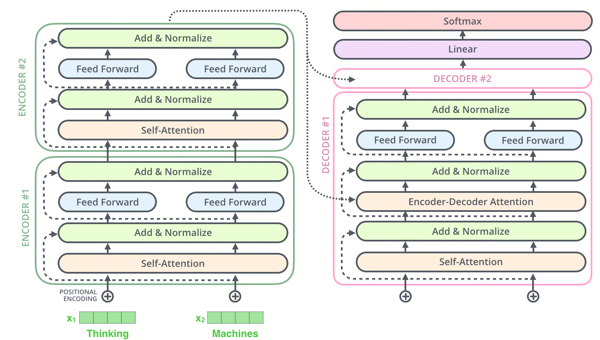
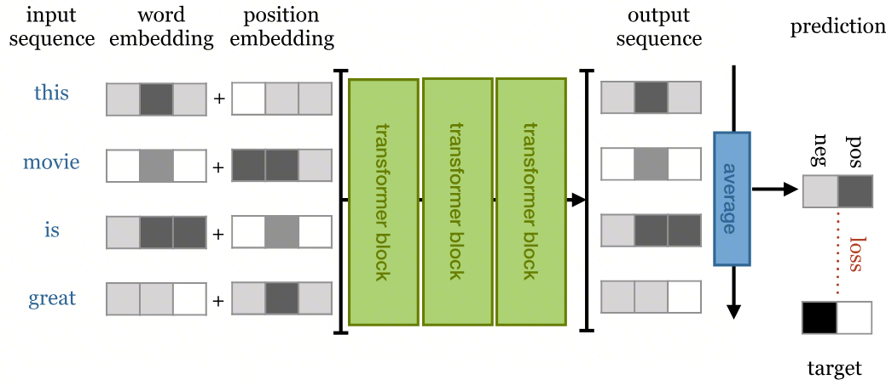

# 从零实现 Transformer（四）：模型组装

> 上一篇我们造好了多头注意力、前馈网络、残差连接等核心零件，准备合体！（我来组成头部，我来组成……）

## 系列目录

1. [PyTorch 基础与神经网络模块](01-pytorch-basics.md)
2. [数据处理与 Transformer 输入层](02-data-and-input-layer.md)
3. [多头注意力机制与核心组件](03-multi-head-attention.md)
4. **Transformer 模型组装**（本篇）
5. [训练、推理与可视化](05-training-and-inference.md)

---

## 1. Mask 构造函数

在组装模型之前，先补上上一章遗留的问题——两个关键的 mask 函数。它们控制着注意力机制"能看到什么、不能看到什么"。

### 1.1 Padding Mask

交叉注意力用 padding mask，屏蔽 `<pad>` 位置，让模型不关注无意义的填充：

```
Q 看 K →     我     吃    苹果   <pad>
  <sos>  [   1      1      1      0   ]
  I      [   1      1      1      0   ]
  eat    [   1      1      1      0   ]
  apple  [   1      1      1      0   ]

应用 mask 前:
              我     吃    苹果   <pad>
  <sos>  [  0.5    1.2    0.8    0.3  ]
  I      [  0.9    2.1    0.4    0.1  ]
  eat    [  0.3    1.8    2.5    0.6  ]
  apple  [  1.1    0.7    2.9    0.2  ]

应用 mask 后：
              我     吃    苹果   <pad>
  <sos>  [  0.5    1.2    0.8   -1e9  ]
  I      [  0.9    2.1    0.4   -1e9  ]
  eat    [  0.3    1.8    2.5   -1e9  ]
  apple  [  1.1    0.7    2.9   -1e9  ]
```

```python
import torch
import torch.nn as nn
import numpy as np


def make_pad_mask(q, k, pad_idx=0):
    """
    构造 Padding Mask
    k.ne(pad_idx): 不等于 pad 的位置为 True(1)，是 pad 为 False(0)
    输出 shape: (Batch, 1, 1, K_Len)，会在 head 和 Q_len 维度广播
    """
    mask = k.ne(pad_idx).unsqueeze(1).unsqueeze(2)
    return mask
```

### 1.2 Subsequent Mask

自注意力用 Subsequent Mask——下三角矩阵，防止 Decoder 看到未来信息：

```
Q 看 K →   <sos>   I    eat   apple
  <sos>  [  1      0     0      0  ]   ← 只能看自己
  I      [  1      1     0      0  ]   ← 只能看 <sos> 和 I
  eat    [  1      1     1      0  ]   ← 看不到 apple
  apple  [  1      1     1      1  ]   ← 全部能看

应用 mask 前的 attention score:
            <sos>   I     eat   apple
  <sos>  [  2.1    0.8   -0.3   1.5  ]
  I      [  0.5    3.2    1.1   0.7  ]
  eat    [  0.3    1.0    2.8   0.4  ]
  apple  [  0.1    0.6    0.9   3.0  ]

应用 mask 后（mask==0 的位置填 -1e9）：
            <sos>   I      eat     apple
  <sos>  [  2.1   -1e9   -1e9    -1e9  ]  ← 只能看自己
  I      [  0.5    3.2   -1e9    -1e9  ]  ← 只能看 <sos> 和 I
  eat    [  0.3    1.0    2.8    -1e9  ]  ← 看不到 apple
  apple  [  0.1    0.6    0.9     3.0  ]  ← 全部能看
```

应用 mask 后，被遮蔽的位置填 `-1e9`，softmax 后变为 0。

```python
def make_subsequent_mask(seq_len):
    """
    构造因果掩码（下三角矩阵）
    输出 shape: (1, 1, seq_len, seq_len)
    """
    mask = torch.tril(torch.ones((seq_len, seq_len), dtype=torch.uint8))
    return mask.unsqueeze(0).unsqueeze(0)
```

### 1.3 Combined Mask

Decoder 的自注意力需要**同时满足**两种约束：不看 padding，也不看未来。怎么办？把两个 mask 做逐元素 `&`，都为 True 的位置才保留：

```
tgt_mask (padding):          subsequent_mask (causal):
[[T, T, F, F]]               [[T, F, F, F],
                              [T, T, F, F],
 ↓ 广播到 (4,4)               [T, T, T, F],
[[T, T, F, F],                [T, T, T, T]]
 [T, T, F, F],
 [T, T, F, F],
 [T, T, F, F]]

逐元素 & 操作 →
combined_mask:
[[T, F, F, F],
 [T, T, F, F],
 [T, T, F, F],    ← 位置2 的第3个token 本是 T&T=T，但 padding mask 说 F
 [T, T, F, F]]
```

??? question "📖 Combined Mask 的广播机制具体是怎么工作的？"

    追踪 shape 变化：

    - `tgt_mask = make_pad_mask(...)` → `(B, 1, 1, tgt_len)`
    - `subsequent_mask = make_subsequent_mask(...)` → `(1, 1, tgt_len, tgt_len)`

    广播规则（从右向左对齐）：

    | 维度 | tgt_mask | subsequent_mask | 广播结果 |
    |------|---------|----------------|---------|
    | dim0 (batch) | B | 1 | B |
    | dim1 (head) | 1 | 1 | 1 |
    | dim2 (Q_len) | 1 | tgt_len | tgt_len |
    | dim3 (K_len) | tgt_len | tgt_len | tgt_len |

    结果 shape：`(B, 1, tgt_len, tgt_len)`。tgt_mask 的 dim2=1 意味着每一行 Q 看到的 padding pattern 相同，而 subsequent_mask 提供了"每行 Q 只能看前面"的约束。`&` 操作取交集，同时满足两个条件。

### 1.4 测试 Mask

```python
q_sim = torch.tensor([[1, 2, 3]])
k_sim = torch.tensor([[1, 2, 0, 0]])  # 0 是 pad

pad_mask = make_pad_mask(q_sim, k_sim, pad_idx=0)
print("Pad Mask:", pad_mask.squeeze())
# tensor([True, True, False, False])

subsequent_mask = make_subsequent_mask(5)
print("Subsequent Mask:\n", subsequent_mask.squeeze())
# tensor([[1, 0, 0, 0, 0],
#         [1, 1, 0, 0, 0],
#         [1, 1, 1, 0, 0],
#         [1, 1, 1, 1, 0],
#         [1, 1, 1, 1, 1]])
```

??? question "📖 Padding Mask 和 Subsequent Mask 有什么区别？"

    | 维度 | Padding Mask | Subsequent Mask |
    |------|------------|----------------|
    | 功能目的 | 屏蔽填充的 pad token | 防止看到未来 token |
    | 使用位置 | Encoder Self-Attn + Decoder Cross-Attn | Decoder Self-Attn |
    | 依赖的信息 | 输入数据中哪些位置是 pad | 仅依赖序列长度 |
    | 是否 batch 相关 | **是**：不同样本 pad 位置不同 | **否**：所有样本共享同一个下三角矩阵 |
    | Shape 模式 | `(B, 1, 1, K_len)` | `(1, 1, T, T)` |

    两者解决的问题本质不同：Padding 是**数据驱动**的，Subsequent 是**结构驱动**的。Decoder Self-Attention 需要用 `&` 将两者合并为 Combined Mask。

---

## 2. 堆叠 Encoder



<center>图源：https://jalammar.github.io/illustrated-transformer/</center>

**上图展示了 Transformer 的经典 Encoder-Decoder 架构。** 左侧的编码器（Encoder）负责理解和编码输入信息，右侧的解码器（Decoder）负责生成目标输出。两者都由多个相同的层堆叠而成，通过残差连接（Add）和层归一化（Normalize）保持训练稳定。从编码器顶部指向解码器的长箭头，就是连接两端的"桥梁"——将编码后的上下文信息传递给解码器。

先聚焦左侧。Encoder 的实现很直接——堆叠多个 EncoderLayer，最后加一层 LayerNorm：

```python
class Encoder(nn.Module):
    def __init__(self, vocab_size, d_model, n_heads, d_ff, n_layers, dropout=0.1):
        super().__init__()
        self.layers = nn.ModuleList([
            EncoderLayer(d_model, n_heads, d_ff, dropout) for _ in range(n_layers)
        ])
        self.norm = nn.LayerNorm(d_model)

    def forward(self, src, src_mask):
        for layer in self.layers:
            src = layer(src, src_mask)
        return self.norm(src)
```

---

## 3. 堆叠 Decoder

注意 Decoder 核心块比 Encoder 多一步——首先通过**带掩码的自注意力**处理已生成的内容，然后通过**交叉注意力**参考 Encoder 的输出，最后经过前馈网络整合信息。最终输出经过 Linear 层和 Softmax 转换为词汇表上的概率分布。

Decoder 的堆叠结构与 Encoder 类似，但多了一个**投影层**——将 `d_model` 映射到 `vocab_size`，输出对应的词表索引：

```python
class Decoder(nn.Module):
    def __init__(self, vocab_size, d_model, n_heads, d_ff, n_layers, dropout=0.1):
        super().__init__()
        self.layers = nn.ModuleList([
            DecoderLayer(d_model, n_heads, d_ff, dropout) for _ in range(n_layers)
        ])
        self.norm = nn.LayerNorm(d_model)
        self.projection = nn.Linear(d_model, vocab_size)

    def forward(self, tgt, enc_output, src_mask, tgt_mask):
        for layer in self.layers:
            tgt, attn_map = layer(tgt, enc_output, src_mask, tgt_mask)
        tgt = self.norm(tgt)
        return self.projection(tgt), attn_map
```

??? question "📖 Decoder 的 projection 层为什么不需要 softmax？"

    这是一个重要的工程设计决策：

    1. **训练阶段**：PyTorch 的 `nn.CrossEntropyLoss` 内部已包含 `log_softmax + NLLLoss`，直接传入 logits 比先做 softmax 再取 log 在数值上更稳定（log-sum-exp trick）
    2. **推理阶段**：若只需 argmax，softmax 是单调递增函数，不改变 argmax 结果，可省略。只有需要实际概率值（如 Beam Search 得分累积）时才需显式 softmax
    3. **内存效率**：vocab_size 通常很大（30K-100K），延迟 softmax 可节省显存

---

## 4. 究极合体：完整 Transformer

零件齐了，开始组装。`Transformer` 类整合 Embedding、Encoder、Decoder，并在 `make_masks` 中统一构造所有 mask：

```python
class Transformer(nn.Module):
    def __init__(self, src_vocab_size, tgt_vocab_size, d_model, n_heads, d_ff, n_layers, dropout=0.1):
        super().__init__()

        self.src_embedding = TransformerInputLayer(src_vocab_size, d_model, dropout=dropout)
        self.tgt_embedding = TransformerInputLayer(tgt_vocab_size, d_model, dropout=dropout)

        self._encoder = Encoder(src_vocab_size, d_model, n_heads, d_ff, n_layers, dropout)
        self._decoder = Decoder(tgt_vocab_size, d_model, n_heads, d_ff, n_layers, dropout)

        self.src_pad_idx = 0
        self.tgt_pad_idx = 0

    def make_masks(self, src, tgt):
        src_mask = make_pad_mask(src, src, self.src_pad_idx)
        tgt_mask = make_pad_mask(tgt, tgt, self.tgt_pad_idx)
        subsequent_mask = make_subsequent_mask(tgt.size(1)).to(src.device)
        combined_mask = tgt_mask & subsequent_mask
        return src_mask, combined_mask

    def forward(self, src, tgt):
        src_mask, tgt_mask = self.make_masks(src, tgt)
        enc_output = self._encoder(self.src_embedding(src), src_mask)
        dec_output, _ = self._decoder(self.tgt_embedding(tgt), enc_output, src_mask, tgt_mask)
        return dec_output

    # 专门暴露给推理阶段用的方法
    def encode(self, src, src_mask):
        return self._encoder(self.src_embedding(src), src_mask)

    def decode(self, tgt, enc_output, src_mask, tgt_mask):
        dec_output, _ = self._decoder(self.tgt_embedding(tgt), enc_output, src_mask, tgt_mask)
        return dec_output
```

??? question "📖 为什么拆分 encode 和 decode 方法？"

    **训练阶段**：Encoder 和 Decoder 一起跑，一把梭。

    **推理阶段**：逐词生成时，每一步都要重新跑 Decoder，但 Encoder 的输出始终不变（源句子没变）。拆开后 Encoder 跑 **1 次**，Decoder 跑 **N 次**，每次复用 enc_output，避免重复编码。

    ```
    训练阶段：一把梭，Encoder 和 Decoder 一起跑
    src → Encoder → enc_output
    tgt（完整） → Decoder → 输出

    推理阶段：逐词生成
    第1步：输入 <BOS>           → 生成 "I"
    第2步：输入 <BOS> I         → 生成 "love"
    第3步：输入 <BOS> I love    → 生成 "you"
    ```

---

## 5. 全流程测试

用随机数据跑一遍，验证整条流水线是否通畅：

```python
src_vocab_size = 100
tgt_vocab_size = 100
d_model = 512
n_layers = 2
n_head = 8

model = Transformer(src_vocab_size, tgt_vocab_size, d_model, n_head, d_ff=2048, n_layers=n_layers)
model.to(device)

# 伪造数据：Batch=2, Src_Len=5, Tgt_Len=6
# 0 是 pad，1 是 sos，2 是 eos
src = torch.tensor([[1, 5, 6, 2, 0], [1, 9, 2, 0, 0]]).to(device)
tgt = torch.tensor([[1, 7, 3, 4, 8, 2], [1, 6, 8, 2, 0, 0]]).to(device)

print("Source Shape:", src.shape)  # (2, 5)
print("Target Shape:", tgt.shape)  # (2, 6)

output = model(src, tgt)
print("Output Shape:", output.shape)  # (2, 6, 100) → (batch, tgt_len, vocab_size)
```

**输出解读**：`(2, 6, 100)` 表示 2 个样本，每个样本 6 个位置，每个位置输出对 100 个词的概率分布（logits）。

---

## 6. 延伸：从 Encoder-Decoder 到 Decoder-Only



<center>图源：https://peterbloem.nl/blog/transformers</center>

**上图展示了 Transformer 用于文本分类的变体。** 输入句子经过多个 Encoder Block 编码后，通过平均池化压缩成一个句子向量，再送入分类层输出预测。这提醒我们：Transformer 的架构并不是固定的，可以根据任务灵活裁剪。

那如果我们把 Encoder 整个去掉，只留 Decoder 呢？这就是 GPT 系列的思路。

??? question "📖 如何构建纯 Decoder 架构（如 GPT）？需要哪些修改？"

    关键改动包括：

    1. **去掉 Encoder 和 Cross-Attention**：只保留 Masked Self-Attention + FFN
    2. **统一输入输出词表**：使用同一个 tokenizer（如 BPE/SentencePiece）
    3. **修改训练目标**：输入 `tokens[:-1]`，标签 `tokens[1:]`，每个位置都参与 loss
    4. **修改推理逻辑**：给定 prompt 自回归续写，不再需要 Encoder memory，添加 KV Cache
    5. **（可选）架构微调**：Post-LN → Pre-LN、添加 RoPE、ReLU → SwiGLU

    核心洞见：Encoder-Decoder → Pure Decoder 本质是从"条件生成"（给定源→生成目标）到"条件续写"（给定前缀→生成后续）的范式转换。

??? question "📖 Decoder-Only 架构如何实现翻译？相比 Encoder-Decoder 有何优缺点？"

    将源语言和目标语言拼接为一个序列 `[source tokens] [SEP] [target tokens]`，使用因果 mask，生成 target 部分时可看到所有 source tokens。

    | 方面 | Encoder-Decoder | Decoder-Only |
    |------|----------------|-------------|
    | 源序列编码 | 双向注意力，编码更充分 | 单向（但可看到全部源） |
    | 架构简洁性 | 复杂（两模块 + Cross-Attn） | 简单（一个模块） |
    | 预训练效率 | 需设计两种目标 | 统一的语言模型目标 |
    | 翻译质量 | 传统上更好（尤其短句） | 大规模后差距缩小 |
    | 生成能力 | 主要用于 seq2seq | 通用生成 |

    GPT-3/4 证明了足够大的 Decoder-Only 模型 + 足够多的数据可以涌现出翻译能力。

---

## 小结

至此，一个完整的 Transformer 模型已经组装完毕。回顾本篇的关键拼图：

| 组件 | 作用 | 核心细节 |
|------|------|---------|
| **Padding Mask** | 屏蔽 `<pad>` 填充位 | 数据驱动，shape `(B, 1, 1, K_len)` |
| **Subsequent Mask** | 防止 Decoder 看到未来 | 结构驱动，下三角矩阵 |
| **Combined Mask** | 合并上述两种约束 | 逐元素 `&`，广播对齐 |
| **Encoder** | 堆叠 N 个 EncoderLayer | 最后加 LayerNorm |
| **Decoder** | 堆叠 N 个 DecoderLayer + 投影层 | projection 输出 logits，不加 softmax |
| **Transformer** | 整合 Embedding + Encoder + Decoder | 拆分 encode/decode 方法供推理复用 |

- **输入**：源语言索引序列 + 目标语言索引序列
- **输出**：每个位置下一个词的 logits（概率分布）

下一篇将赋予模型智慧——用数据训练它，并实现推理和注意力可视化。

---

上一篇：[<< 多头注意力机制与核心组件](03-multi-head-attention.md)

下一篇：[训练、推理与可视化 >>](05-training-and-inference.md)

## 参考文章

- [The Illustrated GPT-2](https://jalammar.github.io/illustrated-gpt2/) — Jay Alammar
- [保姆级教程：Transformer 本质是什么](https://zhuanlan.zhihu.com/p/692407578)
- [Transformer 模型详解（图解最完整版）](https://zhuanlan.zhihu.com/p/338817680)
- [三万字最全解析！从零实现 Transformer](https://zhuanlan.zhihu.com/p/648127076)
- [解剖注意力：从零构建 Transformer 的终极指南](https://zhuanlan.zhihu.com/p/1984265632687087772)
- [The Illustrated Transformer](https://jalammar.github.io/illustrated-transformer/) — Jay Alammar
- [The Transformer Family Version 2.0](https://lilianweng.github.io/posts/2023-01-27-the-transformer-family-v2/) — Lilian Weng
- [Attention? Attention!](https://lilianweng.github.io/posts/2018-06-24-attention/) — Lilian Weng
- [Transformers from scratch](https://peterbloem.nl/blog/transformers) — Peter Bloem
