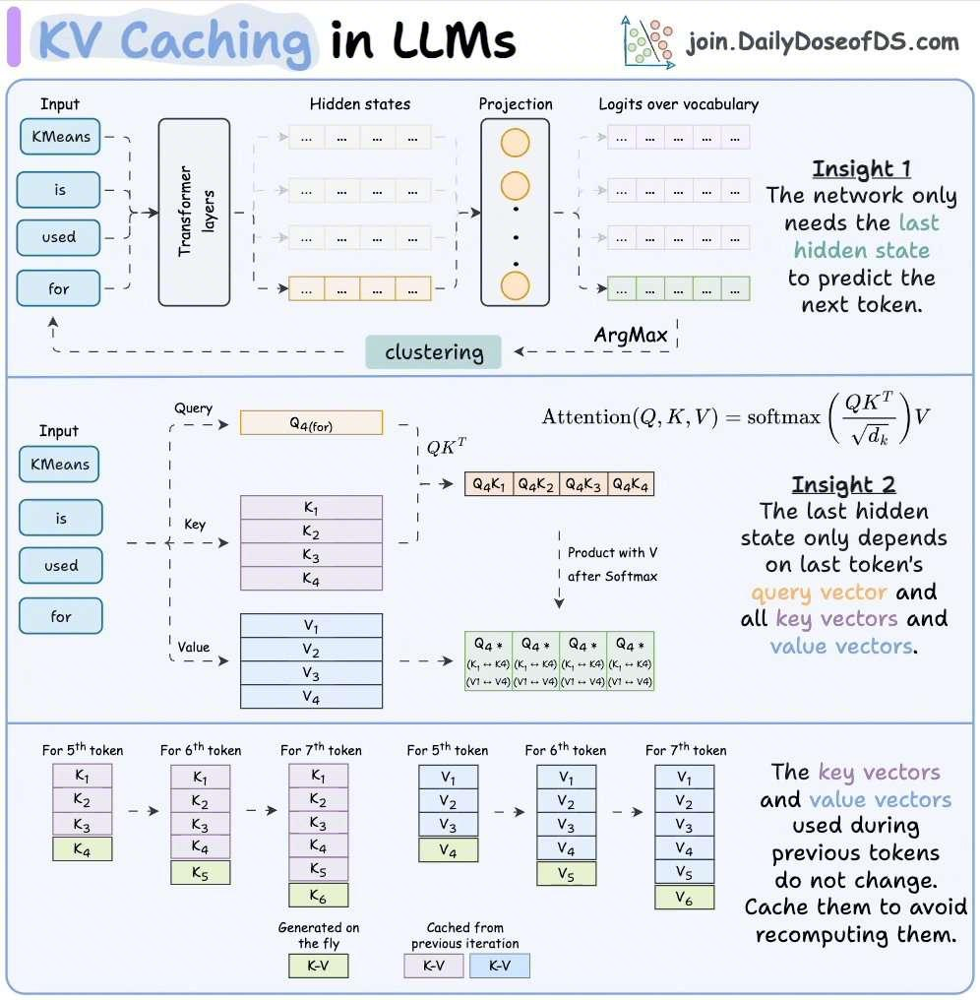
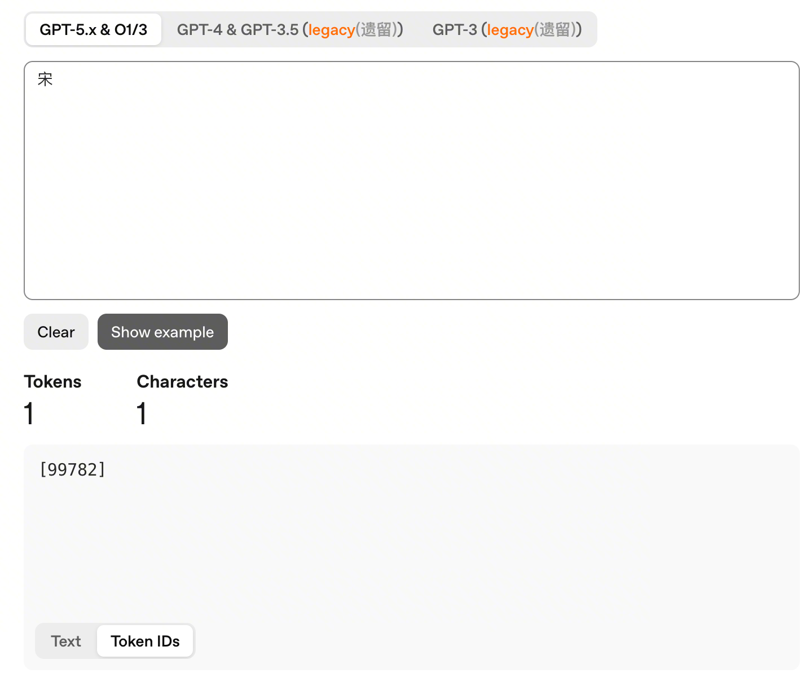
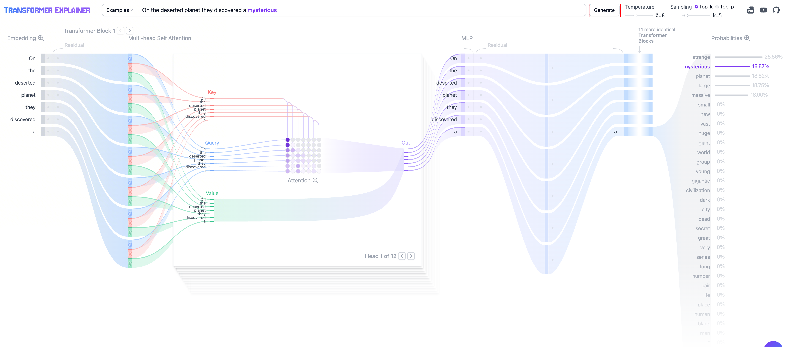
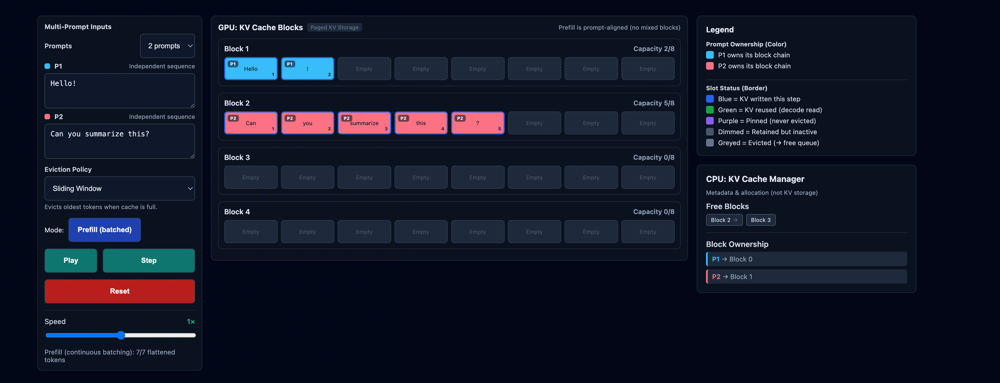

# 从零实现 Transformer（五）：训练、推理与可视化

> 来到最终章啦，我们已经搭好了模型的骨架，现在要怎么赋予它智慧？本篇将介绍训练、推理和注意力可视化的完整流程——用人类的知识浇灌这颗种子，让它长成参天大树。

## 系列目录

1. [PyTorch 基础与神经网络模块](01-pytorch-basics.md)
2. [数据处理与 Transformer 输入层](02-data-and-input-layer.md)
3. [多头注意力机制与核心组件](03-multi-head-attention.md)
4. [Transformer 模型组装](04-transformer-assembly.md)
5. **训练、推理与可视化**（本篇）

---

## 从输入到输出：全局视角

在深入代码之前，先从宏观视角看看 Transformer 是怎么把一串输入变成一串输出的。以字符序列 "h-e-l-l" 为例，整个流程分为四步：

1. **输入数值化（Embedding）**——模型无法直接理解文本，先把每个字符转换为数值向量（词嵌入），同时加入位置嵌入让模型感知顺序。
2. **核心处理（Transformer Block）**——数据流经核心模块，通过自注意力机制理解字符间的关联和依赖。
3. **概率预测（Character Probabilities）**——在每个输出位置，为词汇表中所有字符计算概率得分，颜色越深表示模型越有把握。
4. **生成输出（Output Sequence）**——每个位置选概率最高的字符，逐个拼成输出序列 "e-l-l-o"。

这个"逐个预测、选择最优"的过程，就是 Transformer 生成文本的基本原理。接下来我们看看如何训练模型学会做出正确预测。

### 训练流程总览

```
输入数据 → 模型 → 预测结果
                       ↓
                  损失函数 ← 真实标签
                       ↓
                   损失值(一个数字)
                       ↓
                  反向传播(算梯度)
                       ↓
                  优化器(更新参数)
                       ↓
                  回到第一步，循环
```

---

## 1. 训练前准备：损失函数与优化器

想象你在一个漆黑的山谷里，目标是走到最低点：

- **损失函数**：脚下的地形图，告诉你离谷底还有多远
- **优化器**：你的下山策略，决定每步往哪走、步子迈多大

**不同模型的偏好**

| 环节 | CNN 场景 | Transformer 场景 |
|------|---------|-----------------|
| 损失函数 | Cross-Entropy / Smooth L1 | Cross-Entropy（预测下一个 token） |
| 优化器 | SGD + Momentum / Adam | 几乎统一用 AdamW |
| 学习率 | StepLR / CosineAnnealing | Warmup + 衰减（先升后降） |

```python
import torch
from torch import nn
import torch.optim as optim

# 损失函数：ignore_index=0 忽略 padding 的 loss
criterion = nn.CrossEntropyLoss(ignore_index=0)

# 优化器
optimizer = optim.Adam(model.parameters(), lr=0.0001, betas=(0.9, 0.98), eps=1e-9)

model.train()
```

??? question "📖 Warmup + 衰减学习率策略中，为什么训练初期需要 Warmup？"

    **Warmup 的必要性**：

    - 训练初期参数随机初始化，梯度方向高度不稳定，方差大
    - Adam 的二阶矩估计 $v_t$ 需要若干步来积累统计量；初期 $v_t$ 偏小，有效步长偏大
    - 偏差修正在 $t$ 很小时修正量极大，进一步放大步长

    **直接使用大学习率的后果**：参数被推到损失曲面的"悬崖"上（loss spike）；梯度爆炸（特别是 LayerNorm 之前的层）；训练直接发散（Loss → NaN）。

    "先升后降"是在**探索**（大学习率找好区域）和**利用**（小学习率精细收敛）之间的权衡。

---

## 2. 损失计算：CrossEntropyLoss 详解

**为什么翻译是分类任务？**

在 Decoder 的每个时间步，任务是：从整个词汇表（V 个候选词）中选出一个概率最高的词。这个"从 V 个候选中选一个"的操作，本质就是一个 **V 分类问题**。整个翻译过程 = 连续执行 T 次分类。

**为什么要展平？**

`CrossEntropyLoss` 要求输入是 `(N, C)` 和 `(N,)`，但模型输出是 3D 的 `(Batch, Seq_Len, Vocab_Size)`。

假设 Batch=2, Seq_Len=3, Vocab_Size=5：

```python
# 模型输出 (2, 3, 5) → 展平为 (6, 5)
output.view(-1, 5)

# 标签 (2, 3) → 展平为 (6,)
tgt_label.view(-1)
```

本质：把「2 个句子 × 3 个位置」拉成「6 个独立的分类问题」，每个问题从 5 个词里选 1 个正确的。

---

## 3. Teacher Forcing 训练

训练时，Decoder 的输入不是模型自己的预测，而是**真实的目标序列**——像老师手把手教写字，即使你上一笔写歪了，老师仍然按正确答案引导下一笔。

??? question "📖 为什么不让模型用自己的预测做输入（Teacher Forcing 的必要性）？"

    不用 Teacher Forcing 时，一旦某步预测错误，错误会作为下一步的输入导致"错上加错"（error accumulation）。使用 Teacher Forcing 时，即使某步预测错了，下一步输入仍是正确答案，不会被带偏，训练效率高。

### 训练循环

```python
epochs = 100

for epoch in range(epochs):
    epoch_loss = 0.0

    for src, tgt in loader:
        src, tgt = src.to(device), tgt.to(device)

        # 核心：构造 Decoder 的输入和标签
        tgt_input = tgt[:, :-1]   # 去掉最后一个元素
        tgt_label = tgt[:, 1:]    # 去掉第一个元素

        # 1. 清空梯度
        optimizer.zero_grad()

        # 2. 前向传播
        output = model(src, tgt_input)

        # 3. 计算损失（展平为 2D）
        loss = criterion(
            output.contiguous().view(-1, len(tgt_vocab)),
            tgt_label.contiguous().view(-1)
        )

        # 4. 反向传播
        loss.backward()

        # 5. 更新参数
        optimizer.step()

        epoch_loss += loss.item()

    if (epoch + 1) % 10 == 0:
        print(f'Epoch [{epoch+1}/{epochs}], Loss: {epoch_loss/len(loader):.4f}')

print("训练完成！")
```

??? question "📖 Teacher Forcing 训练中，Decoder 在时间步 t 的输入和标签是什么？"

    输入是**真实目标序列在 t-1 位置的 token，标签是 t 位置的 token**。代码中 `tgt_input = tgt[:, :-1]` 作为输入，`tgt_label = tgt[:, 1:]` 作为标签。因为模型的任务是"给定前面的 token，预测下一个 token"，所以输入必须是"已知的历史"，标签是"要预测的未来"。假设目标序列为 `[<sos>, 我, 爱, 猫, <eos>]`：

    - `tgt_input = [<sos>, 我, 爱, 猫]`（去掉最后一个）
    - `tgt_label = [我, 爱, 猫, <eos>]`（去掉第一个）

    形成对应关系：`<sos>→我`、`我→爱`、`爱→猫`、`猫→<eos>`。`<eos>` 不作为输入，因为它之后没有需要预测的内容。

??? question "📖 Teacher Forcing 会导致曝光偏差（Exposure Bias）吗？如何解决？"

    **会**。训练时模型始终看到正确的历史 token，但推理时必须使用自己预测的 token。训练与推理的输入分布不一致，推理时一旦预测错误，后续可能雪崩式恶化。

    解决方案：

    - **Scheduled Sampling**：以递增概率使用模型自己的预测替代真实 token
    - **Sequence-Level Training**：使用 REINFORCE 等策略梯度方法，直接优化序列级指标
    - **对比训练 / DPO**：现代 LLM 通过 RLHF 或 DPO 部分缓解曝光偏差
    - 对于大模型和大数据集，实际影响往往比理论预期小

??? question "📖 为什么 epochs 要大于 1？数据学一遍不够吗？"

    类比学习备考——不会只看一遍课本就上考场：

    - 第一遍：粗略理解概念（loss 很高）
    - 反复刷题：大量练习、纠错（多轮 epoch）
    - 模拟考试：用没见过的题检验（验证集/测试集）

    不同 epoch 学到的东西不一样：早期学粗粒度模式，中期学细微特征，后期精调决策边界。但也不能训练太多遍——过拟合风险！需要验证集监控、Early Stopping、正则化等手段。

---

## 4. 训练循环每一步的详解

| 步骤 | 权重 W | 梯度 W.grad | Loss | 说明 |
|------|--------|-------------|------|------|
| `zero_grad()` | 不变 | 归零 | 无 | 防止梯度累加 |
| `forward` | 不变 | 0 | 无 | 用当前权重做矩阵运算 |
| `criterion(...)` | 不变 | 0 | 计算得出 | 衡量预测与真实的差距 |
| `backward()` | **不变** | 0 → 具体值 | 不变 | 链式法则计算梯度 |
| `step()` | **更新！** | 不变 | 过时的旧值 | 唯一修改权重的步骤 |

??? question "📖 训练循环 5 个步骤中，哪一步是唯一修改模型权重的步骤？"

    是 `optimizer.step()`。

    - `zero_grad()` 只清零梯度缓存，不碰权重
    - 前向传播用当前权重做矩阵运算，不修改权重
    - `backward()` 计算梯度存在 `.grad` 属性，不修改权重
    - **只有 `step()` 执行 `W = W - lr * grad`**（或更复杂的 Adam 更新）

### 跨 Epoch 的 Loss 变化趋势

```python
Epoch [10/100], Loss: 0.1904  ← 接近 ln(vocab_size)，在"瞎猜"
Epoch [20/100], Loss: 0.0366  ← 快速下降
Epoch [30/100], Loss: 0.0169  ← 学到了主要模式
Epoch [40/100], Loss: 0.0105  ← 精细调整
Epoch [50/100], Loss: 0.0071  ← 在训练集上拟合良好
Epoch [60/100], Loss: 0.0051
Epoch [70/100], Loss: 0.0035
Epoch [80/100], Loss: 0.0026
Epoch [90/100], Loss: 0.0019
Epoch [100/100], Loss: 0.0015
训练完成！
```

??? question "📖 为什么模型刚开始训练时，Loss 大约等于 ln(词表大小)？"

    想象你面前有一个 6 面的骰子（对应词表大小 = 6），每一面出现的概率完全相同，都是 1/6。模型刚初始化、还没训练的时候，就处于这个状态——它不知道下一个词该是什么，所以对词表里每个词都给出差不多相等的概率 1/6。

    初始 Loss ≈ ln(V)，这是正常的，模型在均匀瞎猜。这也是一个很好的 check 点——如果初始 Loss 不符合预期，说明数据或模型有 bug。

---

## 5. 贪心解码推理（Greedy Decode）

训练好的模型有答案，但推理时可是没有标准答案的。推理中的流程是：

1. 先把源句子编码成 Memory
2. 给 Decoder 输入 `<sos>`
3. 模型预测第一个词
4. 把预测的词追加到输入，预测下一个词
5. 直到生成 `<eos>` 或达到最大长度

```python
def greedy_decode(model, src, src_mask, max_len, start_symbol):
    src = src.to(device)
    src_mask = src_mask.to(device)

    # Encoder 只计算一次
    memory = model.encode(src, src_mask)

    # 初始化 Decoder 输入：只有 <sos>
    ys = torch.ones(1, 1).fill_(start_symbol).type(torch.long).to(device)

    for i in range(max_len - 1):
        tgt_mask = make_subsequent_mask(ys.size(1)).to(device)
        out = model.decode(ys, memory, src_mask, tgt_mask)

        # 只关心最后一个时间步的输出
        prob = out[:, -1, :]
        _, next_word = torch.max(prob, dim=1)
        next_word = next_word.item()

        ys = torch.cat([ys, torch.ones(1, 1).type_as(src.data).fill_(next_word)], dim=1)

        if next_word == tgt_vocab['<eos>']:
            break

    return ys
```

### 封装翻译函数

```python
def translate(sentence):
    model.eval()

    src_indices = [src_vocab[w] for w in sentence.split()]
    src_tensor = torch.tensor(src_indices).unsqueeze(0).to(device)
    src_mask = make_pad_mask(src_tensor, src_tensor, 0)

    out_tensor = greedy_decode(model, src_tensor, src_mask, max_len=100, start_symbol=tgt_vocab['<sos>'])

    out_indices = out_tensor.squeeze().tolist()
    translation = []
    for idx in out_indices:
        if idx == tgt_vocab['<sos>']: continue
        if idx == tgt_vocab['<eos>']: break
        translation.append(idx2tar[idx])

    return "".join(translation)


# 见证奇迹的时刻
print("\n=== 测试模型翻译能力 ===")

test_sentences = [
    "I love deep learning",
    "Transformer is all you need",
    "hello world"
]

for s in test_sentences:
    print(f"原文: {s}  -->  翻译: {translate(s)}")
```

原始论文中没提到 KV Cache，不过有篇文章写的很好，配图很生动，有兴趣的可以读一下：



<center>图源：https://www.dailydoseofds.com</center>

??? question "📖 如何用 KV Cache 优化 Greedy Decode？时间复杂度有什么提升？"

    **原始版本**：步骤 t 处理长度 t+1 的序列，Self-Attention 复杂度 O((t+1)²×d)，总复杂度 O(T³×d/3)。

    **KV Cache 版本**：每步只输入最新的一个 token，Q 只有新 token，K/V 从 cache 拼接。每步 Self-Attention 复杂度 O((t+1)×d)，总复杂度**从 O(T³) 降到 O(T²)**。Cross-Attention 的 K/V 第一步计算后缓存，后续直接复用。因果 mask 不再需要：Q 只有 1 个位置，K 只包含历史 token，天然满足因果性。空间代价：需要存储所有层的 K/V Cache，大小 O(layers × T × d)。

    ```python
    def greedy_decode_kv_cache(model, src, src_mask, max_len, start_symbol):
        memory = model.encode(src, src_mask)
        ys = [start_symbol]
        kv_cache = {}  # {layer_id: (K_cache, V_cache)}

        for i in range(max_len - 1):
            # 只输入最新的一个 token
            new_token = torch.tensor([[ys[-1]]])
            new_embed = model.tgt_embedding(new_token)

            for layer in model.decoder.layers:
                # Self-Attention: Q 只有新 token，K/V 拼接缓存
                q = layer.self_attn.q_proj(new_embed)
                k_new = layer.self_attn.k_proj(new_embed)
                v_new = layer.self_attn.v_proj(new_embed)
                
                k = concat(kv_cache[layer.id].K, k_new)
                v = concat(kv_cache[layer.id].V, v_new)
                kv_cache[layer.id] = (k, v)

                # Attention: (1, d) × (d, t+1) → (1, t+1)
                attn_out = attention(q, k, v)
                # ... Cross-Attention + FFN ...

            next_token = argmax(output_layer(attn_out))
            ys.append(next_token)
            if next_token == EOS: break

        return ys
    ```

??? question "📖 Greedy Decode 有什么缺陷？Beam Search 如何改进？"

    **Greedy 的缺陷**：每步只选概率最大的 token，可能错过全局最优序列；一旦某步选了次优 token，后续无法回溯。

    **Beam Search**：维护 k 个候选序列，每步为每个候选扩展所有可能的下一个 token，保留总概率最高的 k 个。复杂度从 O(V×T) 变为 O(k×V×T)，但质量提升显著。

    **现代解码策略**：Top-k Sampling、Top-p（Nucleus）Sampling、Temperature 控制。生成式 LLM 通常使用 Top-p + Temperature 而非 Beam Search。

---

## 6. 可视化注意力

还记得之前 `forward` 返回的 `attn_map` 吗？现在能展示模型在翻译某个中文词时，"盯着"哪个英文词看。

```python
import matplotlib.pyplot as plt
import seaborn as sns


def plot_attention(sentence, translation, attention_weights):
    fig, ax = plt.subplots(figsize=(8, 6))
    sns.heatmap(attention_weights, cmap='viridis',
                xticklabels=sentence.split(),
                yticklabels=list(translation))
    plt.xlabel('Source Words')
    plt.ylabel('Target Words')
    plt.title('Attention Weights')
    plt.show()


# 获取 Attention Map
model.eval()
src_text = "I love deep learning"
src_indices = torch.tensor([src_vocab[w] for w in src_text.split()]).unsqueeze(0).to(device)
src_mask = make_pad_mask(src_indices, src_indices, 0)

enc_out = model.encode(src_indices, src_mask)

tgt_indices = torch.tensor([[
    tgt_vocab['<sos>'],
    tgt_vocab['我'], tgt_vocab['爱'],
    tgt_vocab['深'], tgt_vocab['度'],
    tgt_vocab['学'], tgt_vocab['习']
]]).to(device)
tgt_mask = make_subsequent_mask(tgt_indices.size(1)).to(device)

output, attn_weights = model._decoder(model.tgt_embedding(tgt_indices), enc_out, src_mask, tgt_mask)

# 取第一个样本，平均所有头的注意力
attn_avg = attn_weights[0].mean(dim=0).detach().cpu().numpy()

plot_attention(src_text, "<sos>我爱深度学习", attn_avg[1:])
```

---

## 7. 结语

至此，你已经从零开始构建并训练了一个 Transformer 模型，并完成了一次翻译任务。虽然这个模型很小，数据集也很小，但**原理和 ChatGPT、Claude 模型一样**。你把模型放大，数据放大，训练时间变长，就会得到一个非常强大的模型。用一首现代诗结尾（作者负责输出诗词大意，Claude 老师负责编写）：

> Embedding 把世界万物编织成向量，
> 让语言有了形状，让含义有了方向。
>
> Attention 在向量的海洋中捕捞关联，
> 让每个词回望全文，找到自己的锚点。
>
> Training 让模型一次次预测下一个 Token，
> 在错误与修正之间，逼近语言的本能。
>
> Loss 是黑暗中唯一的灯塔，
> 梯度沿着它的方向，一步步下山。
>
> Scaling 是一个朴素的信仰，
> 参数再多一些，数据再大一些，智能就涌现了。
>
> 模型终于开口，一个 Token 接一个 Token，
> 像孩子学会造句。
>
> 我们用矩阵乘法搭建了一座巴别塔，
> 它不通天，但它开始成为阶梯。

---

## 扩展思考 & 课后作业

**思考题**

??? question "📖 如果让你基于文章的代码，将模型改造为一个简单的 GPT 式 Causal Language Model（纯 Decoder，自回归生成），你需要做哪些修改？"

    1. **去掉 Encoder 和 Cross-Attention**
        - 只保留 Decoder，去掉所有 Cross-Attention 层
        - Self-Attention 使用 Causal Mask（下三角矩阵）
        - 原因：GPT 只需要"回看过去"，不需要源序列

    2. **统一输入输出词表**
        - 不再区分 src_vocab 和 tgt_vocab
        - 使用同一个 tokenizer（如 BPE/SentencePiece）
        - 原因：LM 的输入和输出在同一个空间

    3. **修改训练目标**
        - 输入：`tokens[:-1]`，标签：`tokens[1:]`
        - 每个位置都参与 loss 计算（不只是 Decoder 端）
        - 原因：Causal LM 的目标是预测序列中每个位置的下一个 token

    4. **修改推理逻辑**
        - 给定 prompt，自回归生成续写
        - 不再需要 Encoder memory
        - 添加 KV Cache 提高推理速度

    5. **（可选）架构微调**
        - Post-LN → Pre-LN（训练更稳定）
        - 添加 RoPE 位置编码（更好的长度外推）
        - ReLU → SwiGLU（更好的表达能力）

??? question "📖 Scaling Law 的核心观点是什么？有哪些局限性？"

    **核心观点**：模型性能与参数量 N、数据量 D、计算量 C 呈幂律关系，增加任一因素都能可预测地降低 Loss。**关键证据**：GPT 系列的持续改进；涌现能力（超过阈值后某些能力突然出现）。

    **可能的局限**：

    - **数据墙**：高质量文本数据有限，合成数据效果存疑
    - **收益递减**：幂律意味着改进越来越难
    - **能力不均衡**：数学/推理的 Scaling 效率远低于语言能力
    - **涌现争议**：可能是度量选择的假象
    - **成本与可持续性**：训练成本呈超线性增长

    Scaling Law 可能是"必要但不充分"的——规模是基础，但架构创新（MoE、Mamba）和训练策略创新（RLHF、推理时计算 Scaling）可能带来更高效的提升。

**课后作业**

1. 去 Kaggle 或开源数据集下载一些中英、中日或你喜欢的数据集，把模型扩大，看下能不能训练一个自己的翻译模型。
2. 将模型改为 Decoder-Only 的模型，使用数据集训练下，看下模型会吐出什么结果。

---

上一篇：[<< Transformer 模型组装](04-transformer-assembly.md)

---

## 全系列回顾

1. [PyTorch 基础与神经网络模块](01-pytorch-basics.md) — 张量操作、nn.Module、常用层
2. [数据处理与 Transformer 输入层](02-data-and-input-layer.md) — 词表、Padding、Embedding、位置编码
3. [多头注意力机制与核心组件](03-multi-head-attention.md) — 注意力、FFN、残差连接、Encoder/Decoder Layer
4. [Transformer 模型组装](04-transformer-assembly.md) — Mask、Encoder、Decoder、完整 Transformer
5. [训练、推理与可视化](05-training-and-inference.md) — 损失函数、训练循环、推理、注意力可视化

## 参考文章

- [The Illustrated GPT-2](https://jalammar.github.io/illustrated-gpt2/) — Jay Alammar
- [保姆级教程：Transformer 本质是什么](https://zhuanlan.zhihu.com/p/692407578)
- [Transformer 模型详解（图解最完整版）](https://zhuanlan.zhihu.com/p/338817680)
- [三万字最全解析！从零实现 Transformer](https://zhuanlan.zhihu.com/p/648127076)
- [解剖注意力：从零构建 Transformer 的终极指南](https://zhuanlan.zhihu.com/p/1984265632687087772)
- [The Illustrated Transformer](https://jalammar.github.io/illustrated-transformer/) — Jay Alammar
- [The Transformer Family Version 2.0](https://lilianweng.github.io/posts/2023-01-27-the-transformer-family-v2/) — Lilian Weng
- [Attention? Attention!](https://lilianweng.github.io/posts/2018-06-24-attention/) — Lilian Weng
- [Transformers from scratch](https://peterbloem.nl/blog/transformers) — Peter Bloem

---

## 小彩蛋

安利一些好玩可交互网站：

**OpenAI Tokenizer 可视化**——自由输入文本，看在 OpenAI 中是哪个 token，还能看到 tokenId。果然"宋"是小姓，竟然才排到 99782，人家"王"是 15881。



**Transformer Explainer**——强烈安利！这个网站允许你点击 generate 看下一个 token 是怎么通过前面的所有 token 在 Transformer 中计算出来的，非常直观，能显著提升你对 Transformer 的视觉理解水平！



**KV Cache Visualizer**——可视化交互 KV Cache 的网站。


