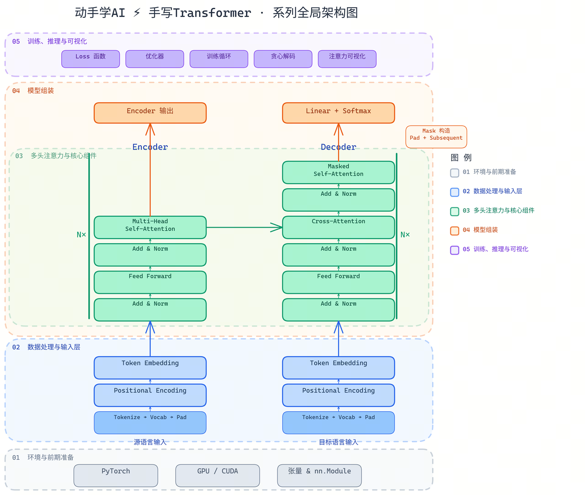

# 从零实现 Transformer

本系列教程将带你从零开始，用 PyTorch 手写一个完整的 Transformer 模型，完成一个中英翻译任务。

## 写在前面

写这系列文章的灵感来自《[夏洛特烦恼](https://movie.douban.com/subject/25964071/)》和《[万物发明指南](https://book.douban.com/subject/34464674/)》——不管你穿越回过去的哪个时间点，总要有点真本事才能引领世界。我怕如果穿回去，只知道 AI 会来，却不知道它是怎么来的。当今世界 AI 巨变的基座就是 Transformer + 老黄的GPU，你提前把论文发出来，直接抢跑 Transformer 的发明权。

这个系列从今年 1 月就开始规划，过年期间到年后的几个周末写写停停，拖更了很久。我作为一个小白，有很多初级的困惑，想着可能会给其他初入门的同学一些参考。工作量确实不小——自己查资料、手写代码、顺整个流程，还有很多东西要重新学和查证。**本系列所有内容初版都是我一个字一个字敲出来的**，后经 AI 润色。你当然可以让 AI 直接生成一份教程，但可能没有这么多小白视角的旁白——把大家可能困惑的地方写出来，给出解释，应该算是独一份了。

我看了很多书和视频后，总结了一个公式：

$$文章信息质量 = \frac{创作者的（知识水平 \times 时间成本 \times 表达能力 \times 单位时间效率）}{知识理解门槛}$$

本系列的短板在于我个人的知识水平和表达能力；优点是投入了较多的时间成本，并且努力在降低理解门槛。写这个系列给我自己带来了很大的收获，也希望能给大家带来一些收获。

## 系列说明

本系列对应的所有代码都可从 https://github.com/songyaolun/transformer-from-scratch 下载到本地 Mac 运行，或直接使用 Colab 运行。当然我更建议大家自己手写一遍加深印象，手推一些模型参数输出。

笔者按内聚的学习内容将全系列分为 **5 个篇章**，推荐学习节奏是**五天工作日，每天一篇，每篇 30-60 分钟**，周末完成课后作业，刚好一周学完。学习步骤：

1. **阅读文章**，回答文中穿插的小问题。有没有思路都可以点开答案看看，觉得答案写得不对欢迎交流。
2. **运行代码**，能自己手写一遍最好。现在大家用 AI 写代码，经常脑子跟不上 AI 的输出，手写虽然慢，但会给你思考的时间。对于一些 cell 的输出，试着手算一下为什么是这样。

## 全局架构总览

在开始之前，先看一张贯穿全系列的架构图，建立整体认知：

图中标注了五篇文章各自负责的模块，学习过程中可随时对照回来。

## 系列文章

| 序号 | 文章 | 内容 |
|------|------|------|
| 01 | [环境与前期准备](01-pytorch-basics.md) | 张量操作、nn.Module、常用层、训练流程 |
| 02 | [数据处理与 Transformer 输入层](02-data-and-input-layer.md) | 词表构建、Padding、Embedding、位置编码 |
| 03 | [多头注意力机制与核心组件](03-multi-head-attention.md) | 注意力公式、FFN、残差连接、Encoder/Decoder Layer |
| 04 | [模型组装](04-transformer-assembly.md) | Mask、Encoder、Decoder、完整 Transformer |
| 05 | [训练、推理与可视化](05-training-and-inference.md) | 损失函数、训练循环、Greedy Decode、注意力可视化 |

## 一键运行

点击下方徽章，在 Google Colab 中打开包含全部代码的 Notebook：

## 环境要求

- Python 3.9+
- PyTorch 2.0+
- matplotlib, seaborn（可视化部分）
